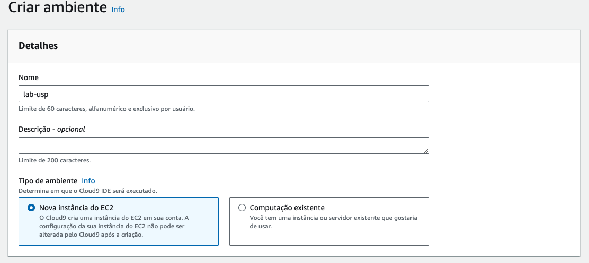
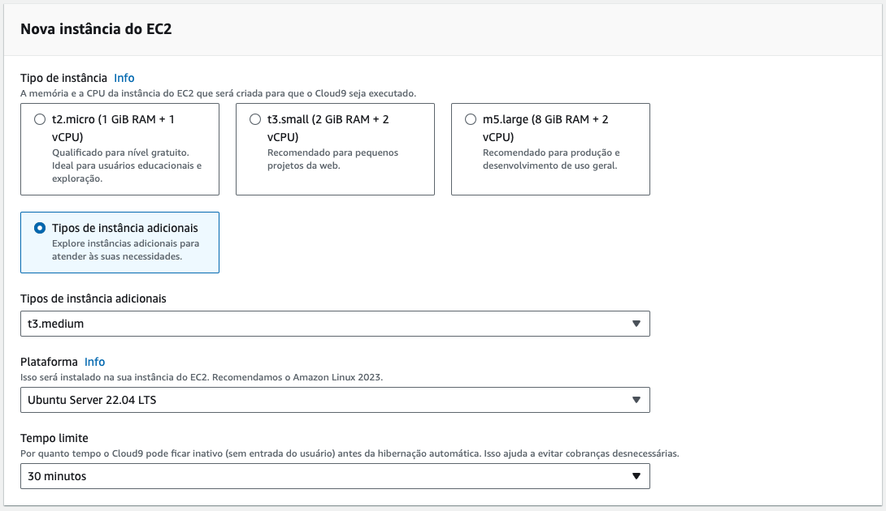
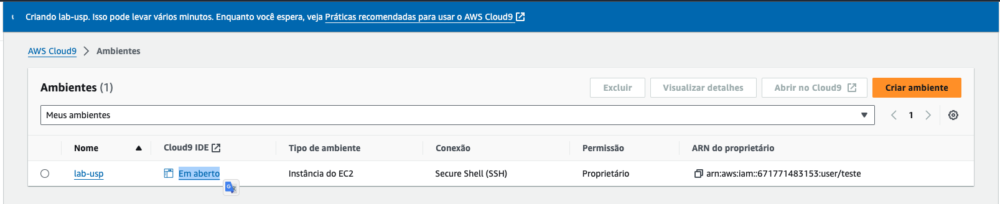
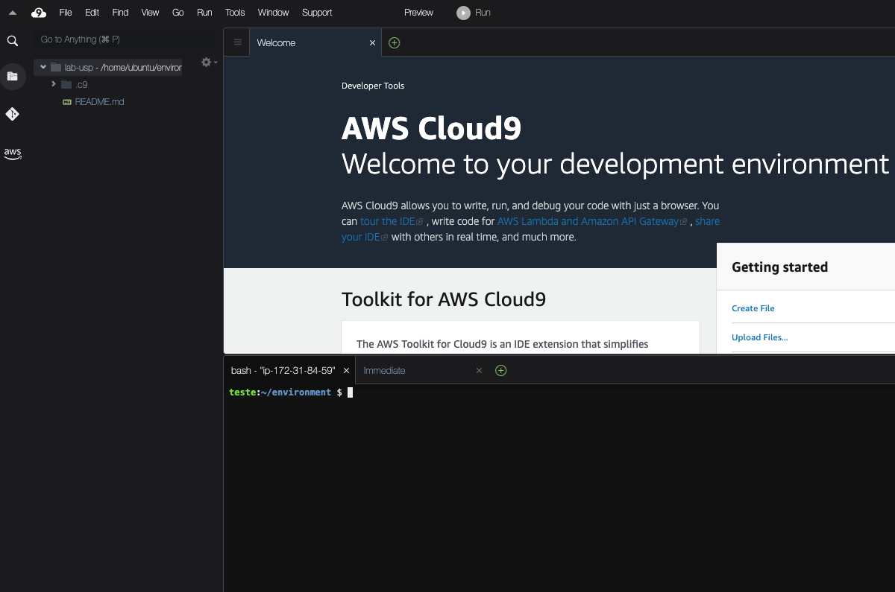
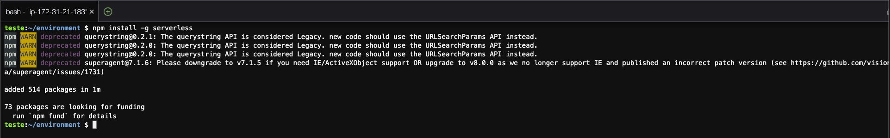
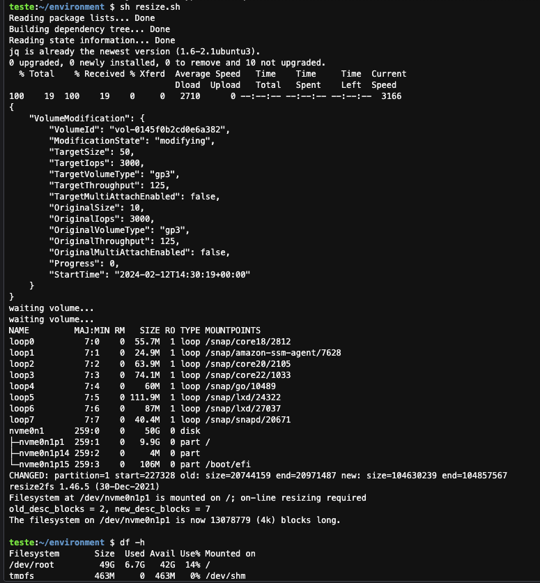
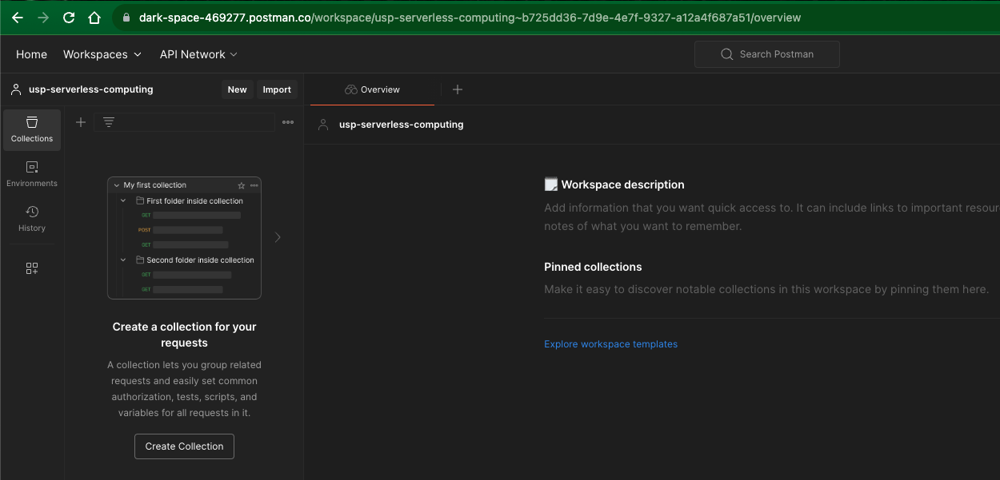

# 00 - Setup e Configuração de ambiente

Você irá utilizar 3 ferramentas para desenvolver os laboratorios:

1. Uma conta da AWS criada por você.
2. [AWS Cloud 9](https://aws.amazon.com/pt/pm/cloud9/?gclid=Cj0KCQiAoKeuBhCoARIsAB4WxtcamFl7cx12ck9DB6XGFvG4AzszNJETY8tzmWb3TMcMxf7d_6aTeeoaAsTXEALw_wcB&trk=fc647821-0350-421a-9d6d-3a5e8fd6345b&sc_channel=ps&ef_id=Cj0KCQiAoKeuBhCoARIsAB4WxtcamFl7cx12ck9DB6XGFvG4AzszNJETY8tzmWb3TMcMxf7d_6aTeeoaAsTXEALw_wcB:G:s&s_kwcid=AL!4422!3!651510591828!e!!g!!cloud%209%20ide!19835810381!145708540943). Uma IDE cloud dentro da AWS para todos terem um ambiente igual e com a autorização para executar os comandos dos exercicios.
3. [Postman](https://www.postman.com/). Uma ferramenta para testar APIs.

### Conta AWS
> [!IMPORTANT]
> O [Free Tier](https://aws.amazon.com/pt/free/?gclid=Cj0KCQiAoKeuBhCoARIsAB4WxtfKNOpVgoJbX6bzj0ljmtQBA_W1tLJzsQyrFmEzWbOGDvwGktYPhksaAqiuEALw_wcB&all-free-tier.sort-by=item.additionalFields.SortRank&all-free-tier.sort-order=asc&awsf.Free%20Tier%20Categories=categories%23compute%7Ccategories%23app-integration%7Ccategories%23devtools%7Ccategories%23databases%7Ccategories%23network&trk=a5a8f3c9-c18a-485c-bbdb-52b795178fbe&sc_channel=ps&ef_id=Cj0KCQiAoKeuBhCoARIsAB4WxtfKNOpVgoJbX6bzj0ljmtQBA_W1tLJzsQyrFmEzWbOGDvwGktYPhksaAqiuEALw_wcB:G:s&s_kwcid=AL!4422!3!536451463166!e!!g!!free%20ec2!12028491727!115492233265&awsf.Free%20Tier%20Types=*all&awsm.page-all-free-tier=1) da AWS é uma oferta promocional que permite aos usuários experimentarem gratuitamente certos serviços da Amazon Web Services (AWS) até um limite especificado durante o primeiro ano após a criação da conta. Essa oferta é projetada para ajudar novos clientes a começar a explorar os serviços da AWS sem custo inicial, oferecendo quantidades generosas de recursos em serviços populares como Amazon EC2 (Elastic Compute Cloud), Amazon S3 (Simple Storage Service) e Amazon DynamoDB, entre outros. A necessidade de cadastrar um cartão de crédito ao se inscrever para o Free Tier serve a dois propósitos principais: primeiro, ajuda a AWS a verificar a identidade do usuário e a autenticidade da conta, assegurando que os serviços estão sendo solicitados por um indivíduo real ou uma entidade empresarial legítima; segundo, permite à AWS cobrar automaticamente quaisquer taxas associadas ao uso de serviços que excedam os limites do Free Tier ou ao uso de serviços não inclusos na oferta gratuita. Isso garante que os clientes possam continuar usando os serviços da AWS sem interrupção após ultrapassarem os limites de uso gratuito, ao mesmo tempo em que protege a AWS contra abusos e fraude, mantendo sua infraestrutura segura e disponível para todos os usuários.

# Guia para Criar uma Conta na AWS e Gerenciar Usuários IAM

Este guia fornece instruções passo a passo sobre como criar uma conta na Amazon Web Services (AWS), por que você deve evitar usar a conta root para operações diárias e como criar e usar um usuário IAM com permissões de administrador.

## Criar uma Conta na AWS

1. Visitar o Site da AWS

   - Acesse o [site oficial da AWS](https://aws.amazon.com/) e clique em **Criar uma conta da AWS**.

2. Preencher os Dados de Cadastro

   - Insira seu endereço de e-mail, senha, nome da conta da AWS e clique em **Continuar**.

3. Escolher o Tipo de Conta

   - Escolha entre uma conta **Pessoal** ou **Empresarial**, preencha as informações necessárias e clique em **Continuar**.

4. Inserir Informações de Contato

   - Complete o formulário de contato e prossiga.

5. Adicionar Informações de Pagamento

   - Insira os detalhes do seu cartão de crédito. A AWS utiliza essas informações para verificar sua identidade e pode aplicar uma pequena cobrança de validação.

6. Verificar por Telefone

   - Forneça um número de telefone e aguarde a ligação ou SMS para verificação.

7. Acessar o Console de Gerenciamento da AWS

   - Após concluir a configuração, acesse o console de gerenciamento da AWS.

## Por Que Evitar o Uso do Usuário Root

O usuário root da sua conta AWS possui acesso irrestrito a todos os recursos e serviços. Usá-lo regularmente pode representar um risco significativo de segurança, incluindo:

- **Risco de Alterações Acidentais**: Com acesso total, é fácil fazer alterações não intencionais em recursos críticos.
- **Exposição a Ataques**: Se as credenciais root forem comprometidas, um invasor teria controle total sobre a conta.

## Criar e Usar um Usuário IAM Administrador

1. Acessar o IAM no Console da AWS

   - No console da AWS, procure e clique em **IAM** para abrir o painel do IAM.

2. Criar um Novo Usuário IAM

   - Clique em **Usuários** e depois em **Adicionar usuário**.
   - Escolha um **nome de usuário** e selecione os tipos de acesso **Acesso programático** e **Acesso ao console de gerenciamento**.
   - Clique em **Próximo: Permissões**.

3. Atribuir Permissões de Administrador

   - Selecione **Anexar políticas existentes de forma direta**.
   - Procure e selecione **AdministratorAccess** para conceder permissões de administrador.
   - Clique em **Próximo: Tags** (opcional) e depois em **Próximo: Revisar**.

4. Revisar e Criar o Usuário

   - Revise as configurações e clique em **Criar usuário**.
   - Anote o **ID de acesso** e a **chave de acesso secreta** fornecidos.

Parabéns! Agora você tem uma conta AWS e entende a importância de evitar o uso do usuário root para tarefas diárias. Com o usuário IAM administrador criado, você pode gerenciar sua conta AWS com maior segurança e eficiência.

### Cloud 9

>O [AWS Cloud 9](https://aws.amazon.com/pt/pm/cloud9/?gclid=Cj0KCQiAoKeuBhCoARIsAB4WxtcamFl7cx12ck9DB6XGFvG4AzszNJETY8tzmWb3TMcMxf7d_6aTeeoaAsTXEALw_wcB&trk=fc647821-0350-421a-9d6d-3a5e8fd6345b&sc_channel=ps&ef_id=Cj0KCQiAoKeuBhCoARIsAB4WxtcamFl7cx12ck9DB6XGFvG4AzszNJETY8tzmWb3TMcMxf7d_6aTeeoaAsTXEALw_wcB:G:s&s_kwcid=AL!4422!3!651510591828!e!!g!!cloud%209%20ide!19835810381!145708540943) é um ambiente de desenvolvimento integrado (IDE) baseado na nuvem que fornece aos desenvolvedores uma plataforma rica e flexível para escrever, executar e depurar código diretamente de qualquer navegador, sem a necessidade de instalar ou manter um ambiente de desenvolvimento local. Este serviço suporta várias linguagens de programação e está integrado a outros serviços da AWS, facilitando a construção, teste e depuração de aplicações na nuvem. Além disso, o Cloud9 promove a colaboração em tempo real entre desenvolvedores, permitindo que equipes distribuídas geograficamente trabalhem juntas em projetos com facilidade. Com recursos como um editor de código, depurador e terminal embutidos, o Cloud9 oferece uma solução tudo-em-um para o desenvolvimento de aplicações serverless, web e de software, proporcionando uma experiência de desenvolvimento eficiente e escalável diretamente na nuvem.

1. Abra o console da AWS e va para o serviço `Cloud 9` através da barra de pesquisas.

   

2. Garanta que a região que esta utilizando é `us-east-1/ Norte da Virgínia`. Você consegue ver isso no canto superior direiro da tela.

    

3. Clique em `Criar ambiente` no lado direito da tela.
4. Coloque o nome `lab-usp` .

   

5. Deixe as configurações como na imagem a seguir. Se atente ao tipo da maquina que deve ser `t3.medium` e o sistema operacional `Ubuntu Server 22.04 LTS`:

   

6. Em `Configurações de rede` deixe como na imagem a seguir:
  
  

7. Caso todos os passos anteriores estejam corretos, clique em `Criar`.

8.  Após a criação clique em `Em aberto`, caso o IDE não tenha aberto automaticamente.

    

9. A criação do ambiente pode levar alguns minutos.

    

10. Para os próximos comandos utilize o console bash que fica no canto inferior do
seu IDE.

    

> [!IMPORTANT]
> O [Serverless Framework](https://www.serverless.com/) é uma ferramenta de código aberto projetada para construir e implementar aplicações serverless de maneira eficiente e simplificada, abstraindo a complexidade de gerenciar a infraestrutura subjacente. Ele permite aos desenvolvedores focar no código da aplicação, automatizando o processo de configuração e implementação de serviços serverless, como funções do AWS Lambda, Amazon API Gateway, triggers do AWS Lambda, entre outros, em várias plataformas de nuvem. Utilizando uma simples configuração em arquivos YAML, o Serverless Framework facilita a definição de recursos, gerenciamento de permissões e integrações entre serviços, promovendo um desenvolvimento ágil e uma experiência de implantação contínua. Ao optar pelo Serverless Framework para criar e gerenciar componentes como o Amazon API Gateway e AWS Lambda, você pode acelerar significativamente o ciclo de desenvolvimento de suas aplicações serverless, garantindo escalabilidade, eficiência e redução de custos operacionais, aproveitando ao máximo a infraestrutura serverless da AWS.
11.  Execute o comando `npm install -g serverless` para instalar o serverless framework.
    
12.  Execute o comando `sudo apt update -y && sudo apt  install jq -y` para instalar o software que irá nos ajudar a ler e manipular Jsons no terminal
13.  Execute o comando `npm install -g c9` para baixar a extenãp que ajudará o Cloud9 a lidar melhor com o como abrir arquivos no IDE. Semelhando ao comando code no vscode.
14. Execute o comando `git clone https://github.com/vamperst/usp-serverless-computing.git` para clonar o repositório com os exercicios.
15. Execute o comando `cd usp-serverless-computing/` para entrar na pasta criada pelo git
16. Execute o comando `cd 01-criando-o-ambiente-de-desenvolvimento` para entrar na pasta com os scripts de Configuração.
17.  Precisamos aumentar o tamanho do volume(HD) do cloud9. Para isso execute o comando  `sh resize.sh`
   

### Postman online

1. Acesse o [postman online](https://go.postman.co/home)
2. Faça login com sua conta Postman ou crie uma nova conta se necessário.
   
   
3. No canto superior esquerdo clique em `Workspaces` e depois em `Create a workspace`
4. Crie uma workspace pessoal (personal) com o nome `usp-serverless-computing`.
   > Workspaces do Postman são ambientes colaborativos que permitem aos usuários organizar, desenvolver, testar e compartilhar APIs dentro de um contexto específico ou projeto. Eles funcionam como espaços de trabalho dedicados onde equipes ou indivíduos podem agrupar coleções de requisições, ambientes, mocks, documentações e monitores de API relacionados a um determinado objetivo ou projeto. Os workspaces facilitam a colaboração em tempo real, permitindo que membros da equipe trabalhem juntos em APIs, vejam atualizações instantâneas e gerenciem o acesso através de configurações de visibilidade e permissões. Disponíveis nas versões pessoal e de equipe, os workspaces do Postman oferecem uma maneira eficiente de segmentar o trabalho de API, promovendo organização, eficiência e sinergia entre os desenvolvedores, independentemente de sua localização geográfica.
