# 01 - Primeira API

OBJETIVO: Criar a primeira api no serviço [Amazon API Gateway](https://aws.amazon.com/pt/api-gateway/) utilizando a estrutura de exemplo do painel.

1. Abra o serviço [API Gateway](https://us-east-1.console.aws.amazon.com/apigateway/main/apis?region=us-east-1)
    
    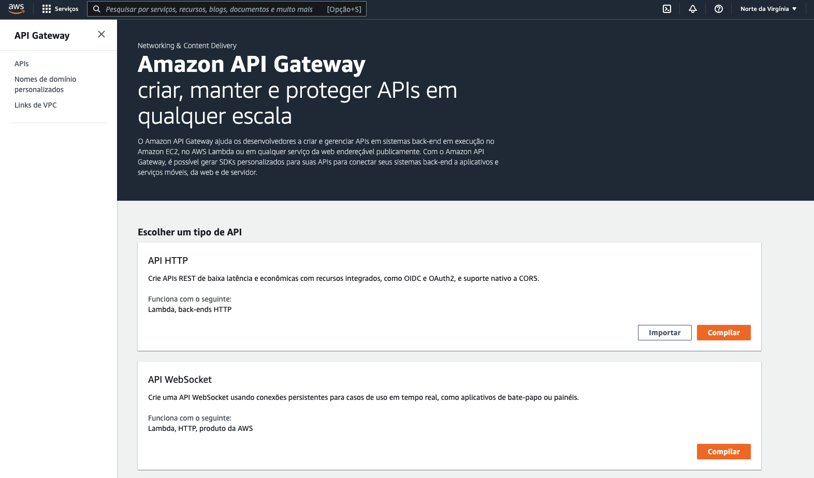

2. Desça nas opções da tela até `API REST` e clique em `importar`.
   
   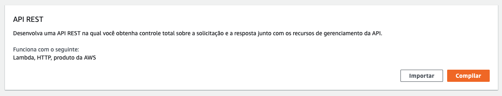

3. Escolha a opção `Importar API` e copie o para o campo `Definição de API` o conteúdo do arquivo [swagger-api.json]([swagger.yaml](https://raw.githubusercontent.com/vamperst/usp-serverless-computing/master/02-API-Gateway/01-Primeira-API/swagger-api.json)). Após colar o conteúdo clique em `Criar API`.
   
   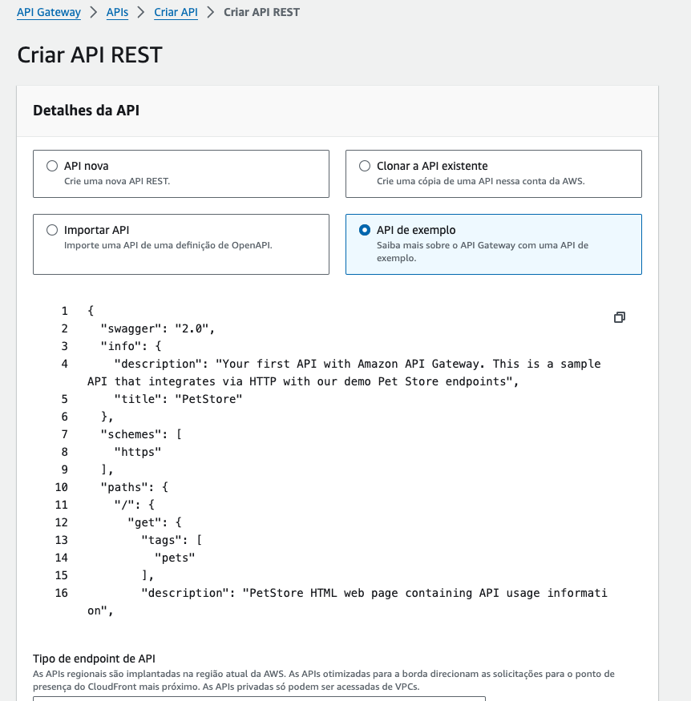

   > [Swagger](https://swagger.io/) é uma especificação e um conjunto de ferramentas de código aberto projetadas para ajudar desenvolvedores a projetar, construir, documentar e consumir APIs RESTful de maneira fácil e eficiente. Atua como um contrato entre o serviço de API e seus consumidores, permitindo uma compreensão clara das funções da API, dos parâmetros esperados e dos formatos de resposta. As principais versões do Swagger incluem a versão 1.x, que introduziu o conceito; a versão 2.0, que trouxe melhorias significativas na especificação, permitindo descrições mais detalhadas das APIs, incluindo informações sobre autenticação, modelos de dados e métodos HTTP suportados; e a OpenAPI Specification (OAS) versão 3.0 e posteriores (3.0.x, 3.1.0), que evoluíram a partir do Swagger, ampliando ainda mais as capacidades de descrição da API com suporte a mais tipos de conteúdo, links entre operações, e outras funcionalidades avançadas. A transição para o termo OpenAPI Specification, adotado pela versão 3.0, reflete a maturidade e a adoção ampla da iniciativa, promovendo ainda mais a interoperabilidade e a padronização das APIs RESTful.

<blockquote>
Este documento é uma especificação Swagger versão 2.0 para uma API chamada "PetShop". A API é descrita como sua primeira API com o Amazon API Gateway e serve como uma demonstração que se integra via HTTP com endpoints de uma loja de animais fictícia.

- **Informações Gerais:**
  - A API suporta o esquema HTTPS.
  - A descrição fornece uma visão geral, mencionando que a API integra-se com os endpoints de demonstração da Pet Shop.

- **Endpoints:**
  1. **GET /**
     - Retorna uma página HTML da PetShop contendo informações de uso da API.
     - Tags: pets
     - Consumes: application/json
     - Produces: text/html
     - Responses:
       - 200: Operação bem-sucedida, retorna uma página HTML.

  2. **GET /pets**
     - Lista todos os serviços para pets.
     - Tags: pets
     - Summary: Lista todos os serviços para pets.
     - Produces: application/json
     - Parâmetros opcionais: tipo de pet (type) e número da página (page) em query.
     - Responses:
       - 200: Operação bem-sucedida, retorna uma lista de pets.

  3. **POST /pets**
     - Cria um serviço para pets.
     - Tags: pets
     - Summary: Cria um serviço para pets.
     - Consumes: application/json
     - Produces: application/json
     - Parâmetros necessários: corpo da requisição com detalhes do novo serviço para pet.
     - Responses:
       - 200: Operação bem-sucedida, retorna a resposta para a criação de um novo serviço para pets.

  4. **OPTIONS /pets**
     - Trata de preflight requests para o endpoint /pets.
     - Consumes: application/json
     - Produces: application/json
     - Responses:
       - 200: Operação bem-sucedida, retorna cabeçalhos necessários para controle de acesso.

  5. **GET /pets/{petServiceId}**
     - Informações para um pet específico.
     - Tags: pets
     - Summary: Informações para um serviço de pet específico.
     - Produces: application/json
     - Parâmetro necessário: petServiceId no path.
     - Responses:
       - 200: Operação bem-sucedida, retorna informações do pet especificado.

  6. **OPTIONS /pets/{petServiceId}**
     - Trata de preflight requests para o endpoint /pets/{petServiceId}.
     - Consumes: application/json
     - Produces: application/json
     - Parâmetro necessário: petId no path.
     - Responses:
       - 200: Operação bem-sucedida, retorna cabeçalhos necessários para controle de acesso.

- **Definições:**
  - **Pets**: Uma lista de objetos pet.
  - **Empty**: Um objeto vazio.
  - **NewPetResponse**: A resposta para a criação de um novo serviço para pets.
  - **Pet**: A estrutura de dados para um pet, incluindo id, tipo e preço.
  - **NewPetService**: A estrutura de dados para criar um novo serviço para pets.
  - **PetType**: Enumeração de tipos de pets (cão, gato, peixe, pássaro, gecko).

- **Integrações e Configurações Adicionais:**
  - A API faz uso de integrações específicas do Amazon API Gateway, como mock e HTTP integrations, com comportamentos de passagem configurados e templates de requisição.
  - Suporta CORS (Cross-Origin Resource Sharing) configurando cabeçalhos de controle de acesso nas respostas.

Esta especificação detalha como a API PetShop permite a criação, listagem e consulta de serviços para pets através de endpoints HTTP, utilizando métodos como GET, POST e OPTIONS, além de definir padrões de resposta e integração específicos para trabalhar com o Amazon API Gateway.
</blockquote>


4. Sua API ficará com a seguinte estrutura:
   
   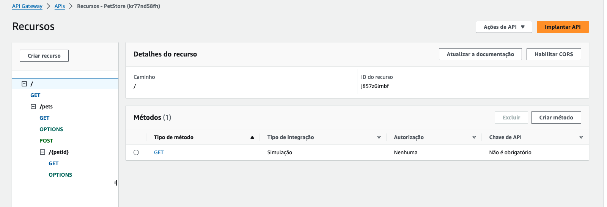

5. Faça testes antes de executar o deploy da API. Para isso vá em `POST` do `/pets/`.
   
   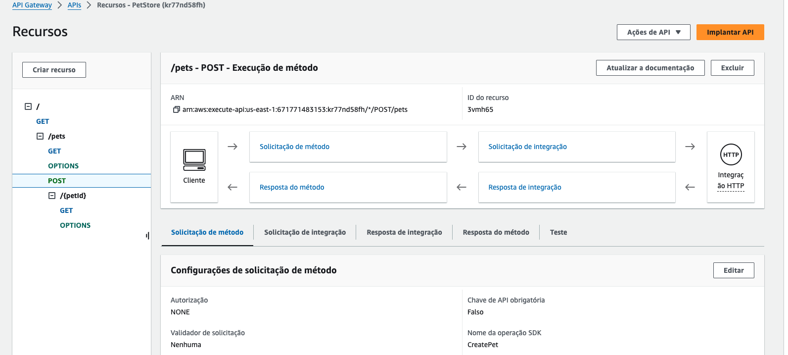

6. Clique na aba `Teste` no centro da tela.
7.  No campo `Corpo de solicitação` cole o seguinte conteúdo:
   ``` json
   {"type": "dogbath", "price": 10.51}
   ```

   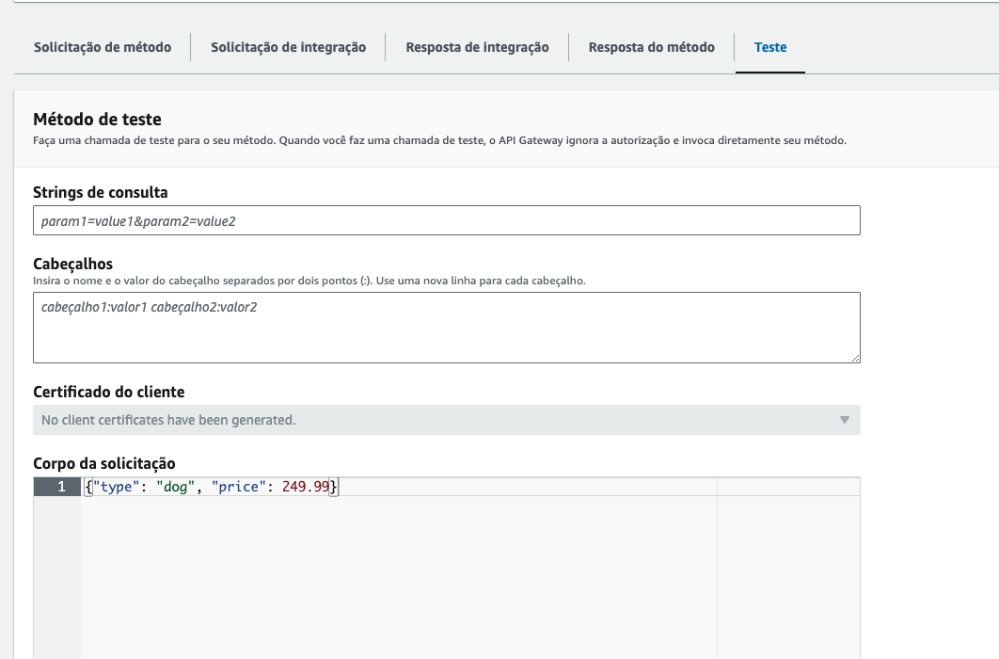

8.  Na parte inferior da tela clique em `Teste`. Você executou o teste dessa chamada da sua API. Você pode ver a resposta em `Corpo de resposta` e todos os logs da chamada em `Logs`
    
    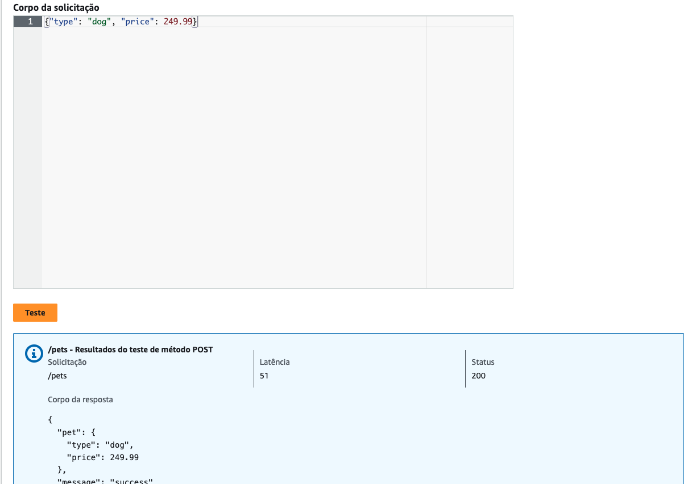

9.  Agora sim é hora de implantar a API para ter uma URL a ser chamada. Para isso visite o canto superior direito da tela clique em `Implantar API`
    
    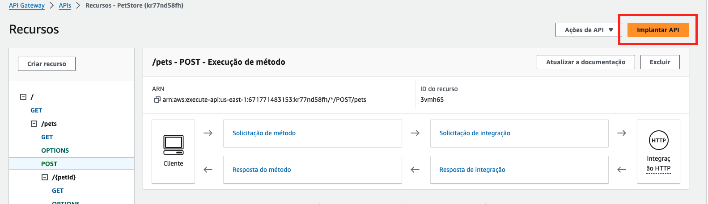

10. Preencha os campos do formulário como na imagem abaixo:

    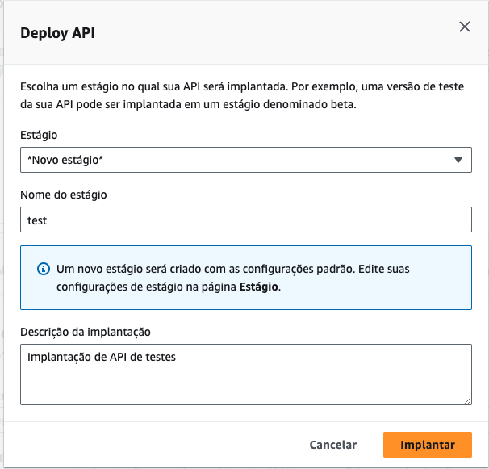

11. Clique em `Implantar`.
12. Pronto você criou sua primeira API no API Gateway e a URL para chamar esta na tela no campo `Invocar URL`.
13. Vamos executar chamadas de teste via [POSTMAN](https://go.postman.co/home) para testar a API externamente. No topo direito clique em `Ações de estágio` e clique em `Exportar`.
    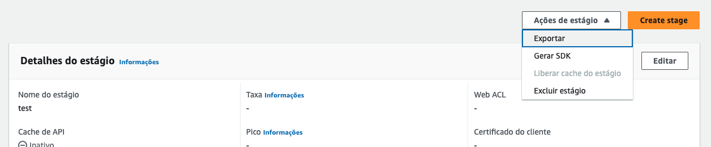

14. Escolha as opções abaixo e clique em `Exportar API`:
    1. Tipo de especificação de API: `Swagger`
    2. Formanto: `YAML`
    3. Extensões: `Exportar com extensões Postman`

    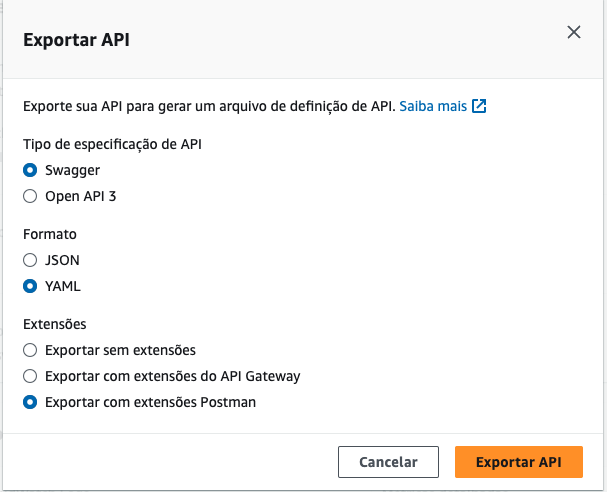

15. Abra o [POSTMAN](https://go.postman.co/home) no navegador para carregar o arquivo que foi baixado no passo anterior descrevendo como utilizar a API. Certifiquesse de que esta na workspace `usp-serverless-computing`.
16. Dentro do Postman clique em `Import`.
    
    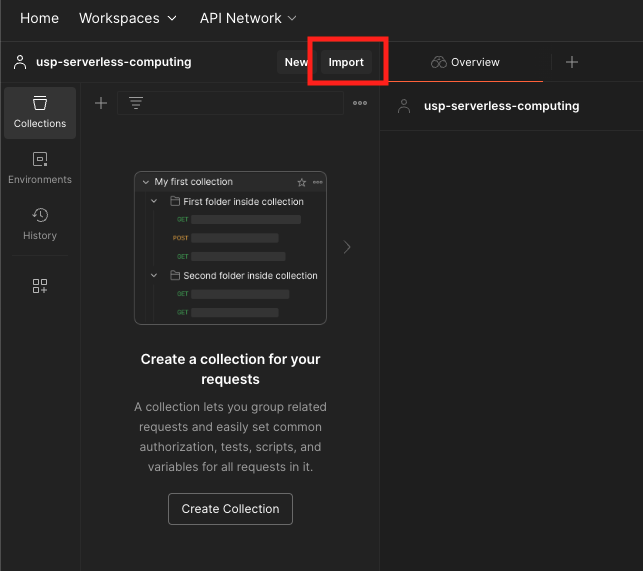

17. Carregue o arquivo recém baixado do API Gateway. Após carregar o arquivo o postman ficará como na imagem abaixo, cliquem em `Import`:
    
    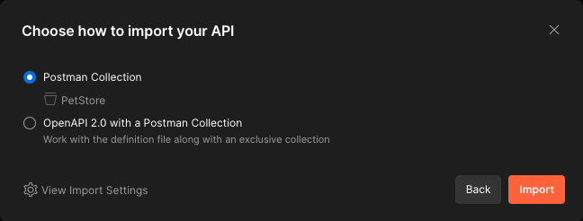

18. Expanda os campos até chegar em `POST Create Pet Service` e clique para abrir no editor. Copie o json abaixo no corpo da requisição na aba `Body`.
    ``` json
    {
      "type": "catGrooming",
      "price": 12.50
    }
    ```
    
    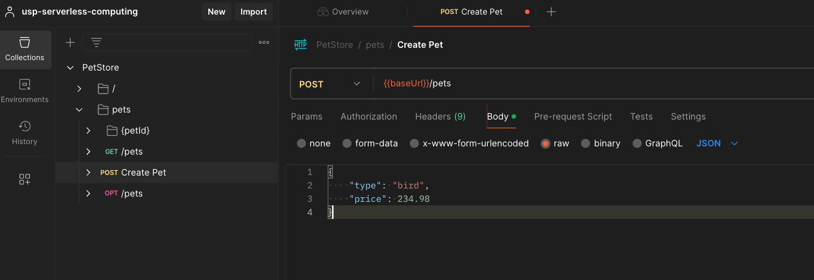

19. Clique em `Send` na lateral direita da tela. Você acabou de fazer uma chamada para sua API via postman.
    
    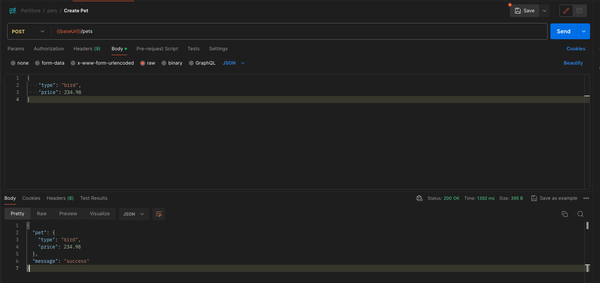
20. Agora você fará uma chamada de listagem. Para isso clique em `Get /pets` para abrir no editor.

    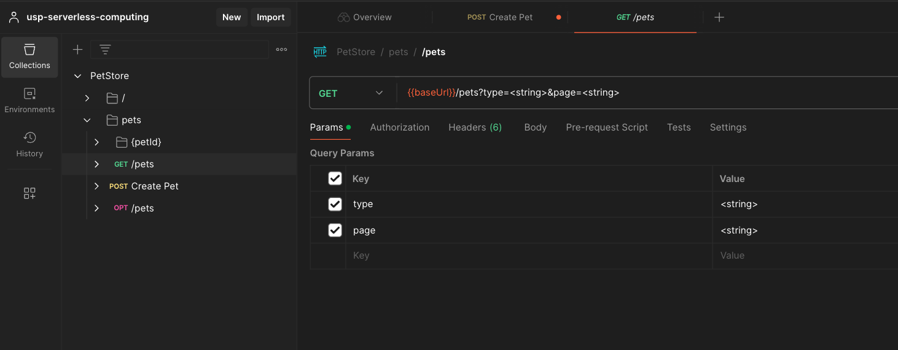

21. Edite o valor do campo `type` para `dogBath` e o valor do campo `page` para `1`.
    
    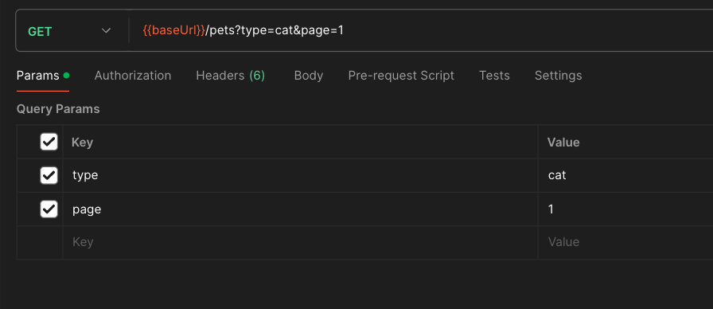

22. Clique em `Send` no superior direito para executar a listagem.

    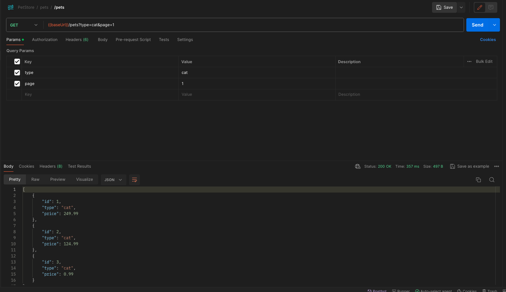

23. Como ultimo teste, o path principal da sua API retorna um HTML quando chamada via método GET(Caso dos navegadores). Retorne ao API Gateway e copie a URL da sua API e cole no navegador.
    
    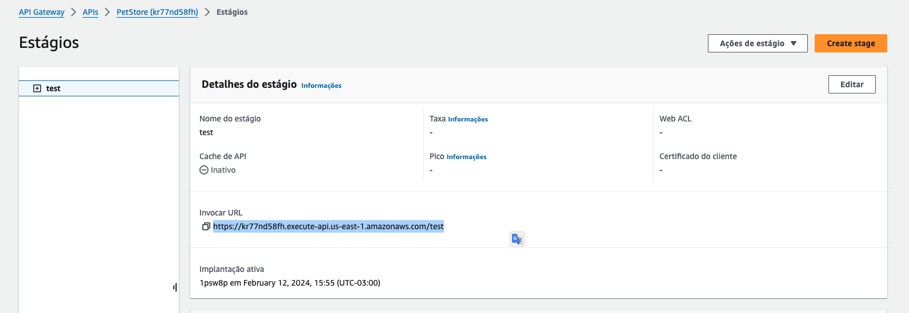

    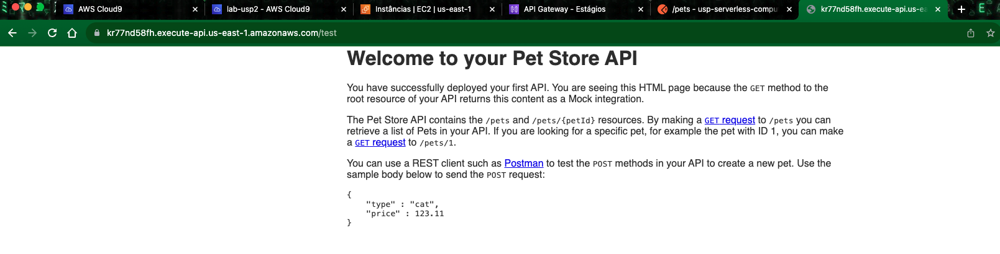
