# 03 - Validação e Autenticação.

Nesse exercicio você irá montar uma arquitetura de RESTFull API com backend em lambda onde as chamadas tem seu formato validado diretamente pelo API Gateway utilizando [Json Schema](https://json-schema.org/) e a autenticação é feita por [chaves de API](https://docs.aws.amazon.com/pt_br/apigateway/latest/developerguide/api-gateway-setup-api-key-with-console.html).

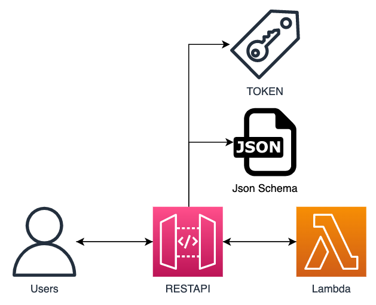


1. Primeiro você vai criar a função lambda que irá receber os eventos da API. Para isso vá para o console do [Lambda](https://us-east-1.console.aws.amazon.com/lambda/home?region=us-east-1#/functions) e clique em `Criar função`.
2.  Preencha os campos com os seguintes valores:
    1. Nome da função: `rest-api-validation`
    2. Tempo de execução: `Python 3.12`

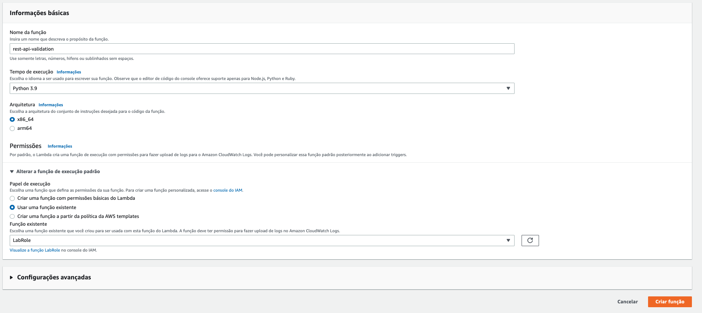

3. Clique em `Criar função` no final da página.
4. No IDE da função (Origem do código) copie e cole o código abaixo.

```python
import json

def lambda_handler(event, context):
    
    print(json.dumps(event))
    response = json.loads(event["body"])
    response["Response"]="Validated API"
    
    return {
        'statusCode': 200,
        'body': json.dumps(response)
    }
```

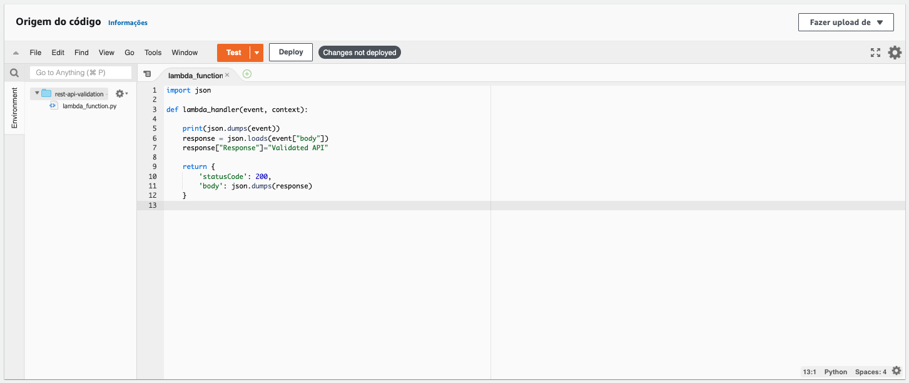

<blockquote>
Este código Python é um exemplo de uma função handler utilizada em uma função AWS Lambda, projetada para responder a eventos HTTP, como os gerados por uma API Gateway da AWS. Vamos detalhar cada parte do código:

- `import json`  
  Importa o módulo `json`, que é usado para codificar e decodificar dados em formato JSON, um formato de troca de dados comum em aplicações web e APIs.

- `def lambda_handler(event, context):`  
  Define a função `lambda_handler`, que é o ponto de entrada para a execução da função Lambda. AWS Lambda automaticamente passa dois argumentos para esta função: `event` e `context`.
  
  - `event`: Um objeto que contém informações sobre o evento que acionou a função Lambda. Para solicitações HTTP via API Gateway, `event` contém detalhes da solicitação, como o corpo da mensagem, parâmetros de consulta e cabeçalhos.
  
  - `context`: Um objeto que fornece métodos e propriedades que fornecem informações sobre a invocação, o ambiente e o ciclo de vida da execução da função Lambda.

- `print(json.dumps(event))`  
  Imprime uma string formatada em JSON do objeto `event` no log da função Lambda. `json.dumps()` é usado para converter o objeto `event` em uma string JSON.

- `response = json.loads(event["body"])`  
  Extrai o corpo da solicitação, que é esperado como uma string JSON, do objeto `event` e o converte de volta em um objeto Python usando `json.loads()`. O corpo da solicitação é onde os dados enviados pelo cliente são tipicamente contidos em uma solicitação HTTP POST.

- `response["Response"]="Validated API"`  
  Modifica o objeto `response` adicionando ou atualizando a chave `"Response"` com o valor `"Validated API"`. Isso serve como uma resposta modificada que será enviada de volta ao cliente.

- `return { 'statusCode': 200, 'body': json.dumps(response) }`  
  Retorna um objeto que representa a resposta da função Lambda para o API Gateway. Este objeto contém dois campos principais:
  
  - `statusCode`: Um código de status HTTP. `200` indica sucesso, significando que a função Lambda foi executada sem erros.
  
  - `body`: O corpo da resposta, que é o objeto `response` modificado, convertido de volta para uma string JSON usando `json.dumps()`. Este será o corpo da resposta HTTP enviada ao cliente.

Este código é um exemplo básico de como processar solicitações HTTP e responder com dados modificados em uma função AWS Lambda, demonstrando a manipulação de dados JSON de entrada e saída, que é uma prática comum ao desenvolver APIs RESTful com AWS Lambda e API Gateway.

</blockquote>

5. Clique em `Deploy` no topo do IDE que acabou de editar o código da função Lambda para atualizar o código da função.
6. Hora de criar a API que irá utilizar esse lambda como backend. Vá para o [painel do api gateway](https://us-east-1.console.aws.amazon.com/apigateway/main/apis?region=us-east-1) e clique em `Criar API` no canto superiror direito.
7. Em `API REST` clique em `compilar`

  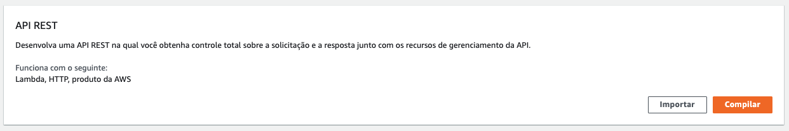

8. Preencha os campos da seguinte maneira e clique em `Criar API`:
   1. Nome da API: `rest-api-with-validation`
   2. Tipo de endpoint de API: `Regional`

  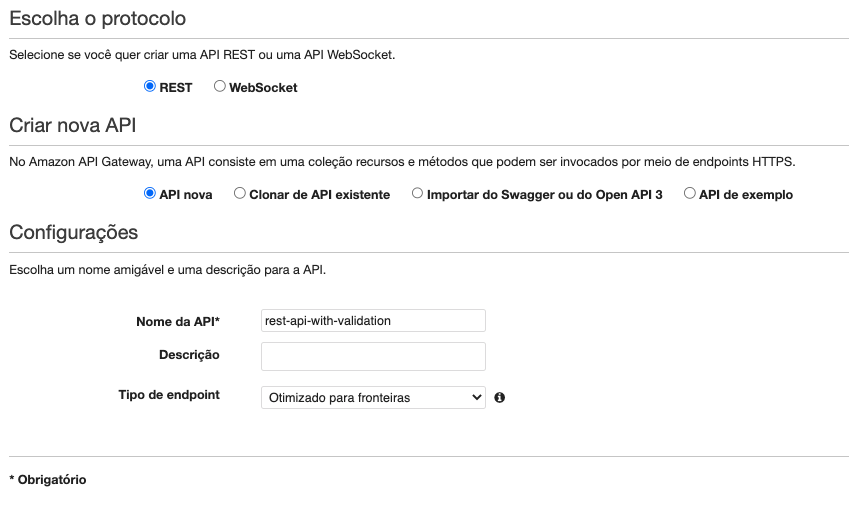

9. Clique em `Criar recurso` para criar o caminho de usuarios da API.
    
    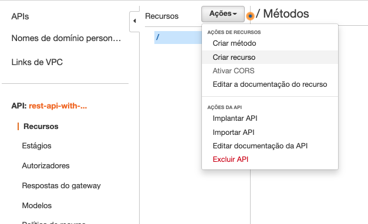

10. Preencha da seguinte maneira e clique em `Criar recurso`.
    1.  Nome do recurso: `user`
    2. Ativar CORS do API Gateway: Selecionado

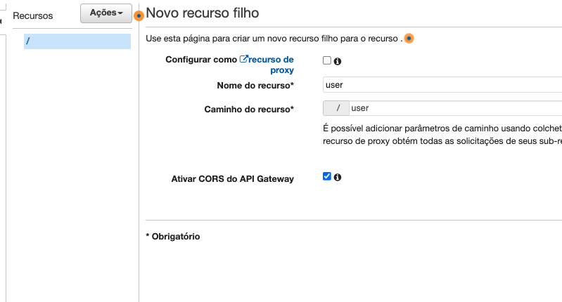

11.  De volta ao painel da api com o recurso user récem criado selecionado  e então clique em `Criar recurso`.

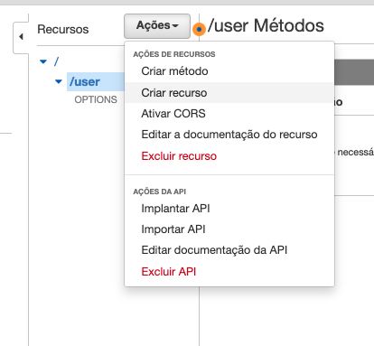

12. Preencha da seguinte maneira e clique em `Criar recurso`.
    1. Nome do recurso: `create`
    2. Caminho do recurso: `/user/`
    3. Ativar CORS do API Gateway: Selecionado

  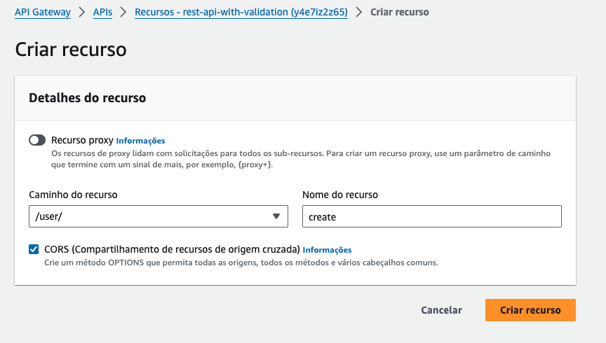

13.  Com o recurso create récem criado selecionado clique em `Criar Método` na lateral direita da tela.

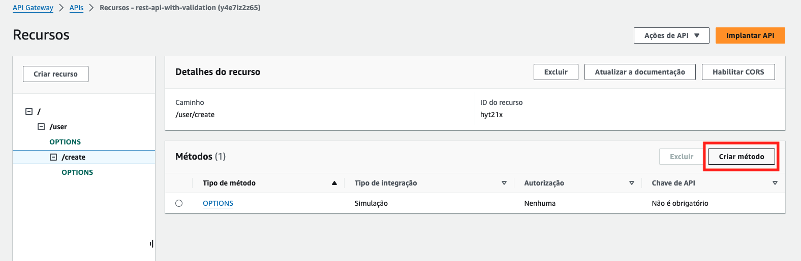

14.   Preencha a integração conforme as informações abaixo, clique em `Criar Método`:
    1.  Tipo de método: `POST`
    2.  Tipo de Integração: `Função Lambda`
    3.  Região do Lambda: `us-east-1`
    4. Função Lambda: `rest-api-validation`
    5. Integração do proxy do Lambda: Selecionado


  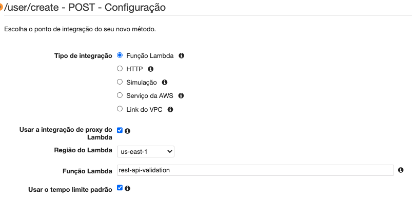
  
  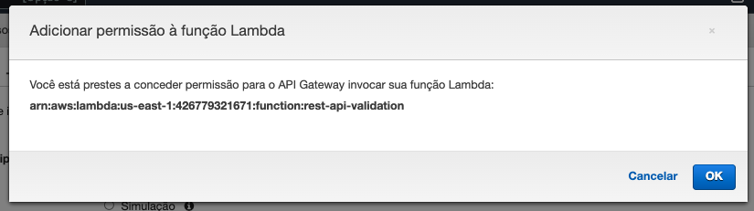


15.  Na lateral esquerda clique em `Modelos`.
16. Clique em `Criar Modelos`.

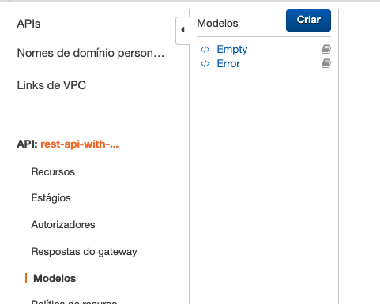

18. Preencha os campos com os seguintes valores:
    1. Nome do modelo: `UserCreateRequest`
    2. Tipo de conteúdo: `application/json`
    3. Esquema do modelo: 
``` json
{
    "title": "Root Schema",
    "type": "object",
    "required": [
        "name",
        "age",
        "dateofregistry"
    ],
    "additionalProperties": false,
    "properties": {
        "name": {
            "title": "The name Schema",
            "type": "string"
        },
        "age": {
            "title": "The age Schema",
            "minimum": 0,
            "maximum": 100,
            "type": "integer"
        },
        "dateofregistry": {
            "title": "The dateofregistry Schema",
            "pattern": "^\\d{4}\\-(0[1-9]|1[012])\\-(0[1-9]|[12][0-9]|3[01])$",
            "type": "string"
        }
    }
}       
```

<blockquote>

Este JSON Schema define a estrutura esperada para um objeto JSON, especificando os tipos de dados permitidos, restrições e quais propriedades são obrigatórias. Aqui está uma análise detalhada de cada parte do schema:

- `"title": "Root Schema"`  
  Define um título para o schema, que é "Root Schema". Este é um identificador amigável que descreve o que o schema representa.

- `"type": "object"`  
  Especifica que o tipo de dado esperado é um objeto. Isso significa que o JSON validado por este schema deve ser um objeto com propriedades e valores.

- `"required": ["name", "age", "dateofregistry"]`  
  Lista as propriedades que são obrigatórias no objeto. Qualquer objeto validado por este schema deve conter as propriedades `name`, `age` e `dateofregistry`.

- `"additionalProperties": false`  
  Indica que propriedades adicionais não listadas explicitamente em `"properties"` não são permitidas. Isso reforça a estrutura do objeto, garantindo que apenas as propriedades definidas sejam incluídas.

- `"properties": { ... }`  
  Define as propriedades permitidas no objeto, junto com os tipos de dados e restrições para cada uma.

  - `"name": { ... }`  
    Define a propriedade `name` como uma string. Não há restrições adicionais de formato ou comprimento especificadas para esta propriedade.

  - `"age": { ... }`  
    Especifica que a propriedade `age` deve ser um número inteiro (`"integer"`), com um valor mínimo de `0` e máximo de `100`. Isso restringe a idade a um intervalo razoável de 0 a 100 anos.

  - `"dateofregistry": { ... }`  
    Define a propriedade `dateofregistry` como uma string que deve seguir um padrão específico, representando uma data no formato `AAAA-MM-DD` (onde `AAAA` é o ano, `MM` é o mês e `DD` é o dia). O padrão é definido usando uma expressão regular que valida o formato da data.

Este JSON Schema é uma ferramenta poderosa para validar a estrutura de dados de objetos JSON, garantindo que apenas dados precisos e no formato correto sejam processados pela aplicação. Ele é comumente utilizado em APIs e sistemas de intercâmbio de dados para validar as entradas e saídas de dados, promovendo a integridade e a confiabilidade dos dados manipulados.

</blockquote

19. Clique em `Criar` no infeiror direito da página.

20. Na lateral esquerda clique em `Recursos`

21. Clique no `POST` abaixo do recurso create.

22. Clique em `Solicitação de método`

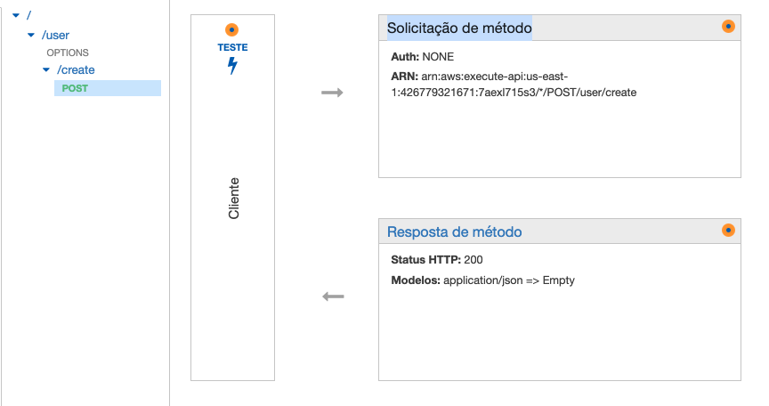

23. Clique em Editar na lateral direita da tela.

24. Em `Validador de solicitação` escolha a opção `Validar corpo, parâmetros de string de consulta e cabeçalhos` e clique no sinal de check no final da linha.

25. Clique em `Corpo de solicitação` e então em `Adicionar modelo`

26. Preencha com:
    1. Tipo de conteúdo: `application/json`
    2. Nome do modelo: `UserCreateRequest`
    3. Clique em `Salvar`

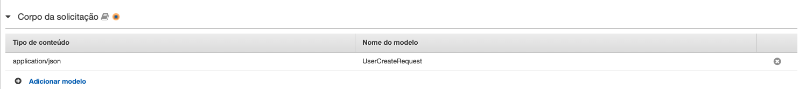

27.  Para facilitar a vida de quem integra vamos criar um padrão de mensagem de erro para validação de corpo de mensagem onde a causa do erro apareça na resposta. Para tal, clique em `Respostas do gateway` na lateral esquerda do painel do api gateway.
28. Selecione `Corpo de solicitação incorreto`, em modelos de resposta e clique em `Editar`.
   
    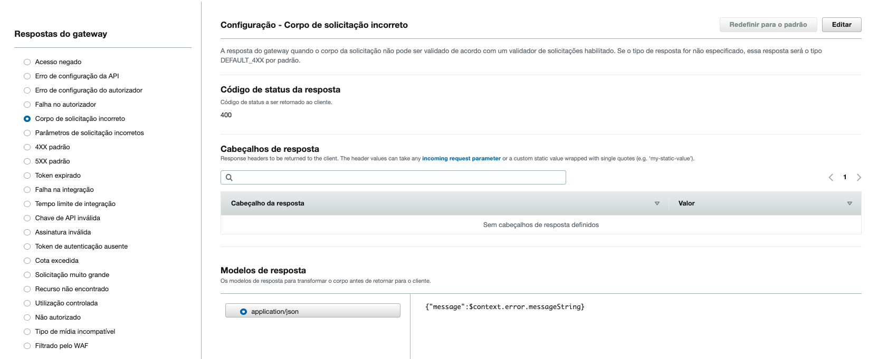

29. Cole no `Corpo do modelo` em `Modelos de resposta` o seguinte json:

``` json
{"message": "$context.error.message", "error": "$context.error.validationErrorString"}
```
<blockquote>
Este JSON Schema é um modelo para estruturar uma mensagem de erro personalizada como resposta para chamadas de API que resultam em um corpo de solicitação incorreto no Amazon API Gateway. O schema define dois campos principais: `message` e `error`.

- `"message": "$context.error.message"`  
  Este campo é destinado a conter uma mensagem de erro geral, que informa ao cliente da API que houve um erro com a solicitação enviada. O valor `$context.error.message` é uma variável de template do API Gateway que será substituída pela mensagem de erro gerada pelo API Gateway durante o processamento da solicitação. Esta mensagem pode ser algo genérico como "Erro de validação na solicitação" ou mais específico, dependendo do contexto do erro.

- `"error": "$context.error.validationErrorString"`  
  O campo `error` é projetado para fornecer uma string detalhada descrevendo o erro de validação que ocorreu. O valor `$context.error.validationErrorString` é outra variável de template do API Gateway, que será preenchida com a descrição detalhada do erro de validação encontrado. Isso pode incluir informações específicas sobre quais partes do corpo da solicitação são inválidas, faltando ou não correspondem ao esperado pelo API Gateway.

Esse schema permite que o Amazon API Gateway retorne respostas de erro mais informativas e úteis para os desenvolvedores que consomem a API, ajudando-os a entender rapidamente a natureza do erro e como corrigi-lo. Personalizar respostas de erro desta forma é uma prática recomendada para tornar as APIs mais amigáveis e fáceis de usar.

Para mais informações sobre como trabalhar com variáveis de contexto e personalizar respostas de erro no Amazon API Gateway, você pode consultar a documentação oficial da AWS sobre o [API Gateway](https://docs.aws.amazon.com/apigateway/latest/developerguide/welcome.html).
</blockquote>

30. Clique em `Salvar Alterações`.
31. Na lateral esquerda clique em `Recursos`.
    
32. Hora de fazer o deploy da sua API. Clique  `Implantar API` no topo direito da tela.
    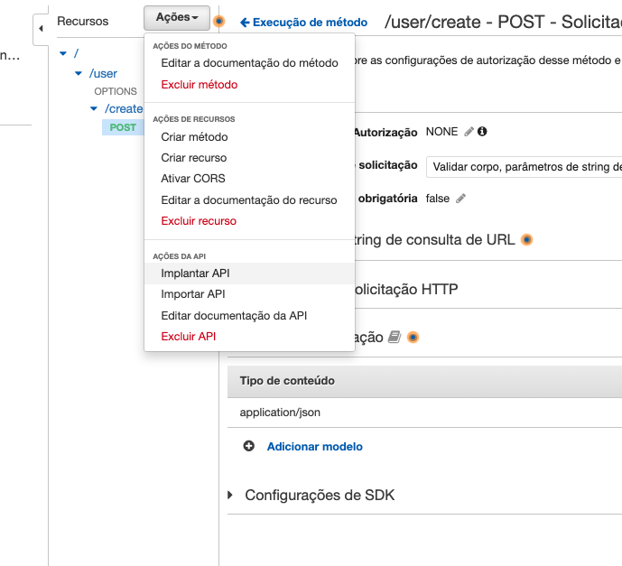

33. Na tela que aparece preencha como descrito:
    1. Estágio de implantação: `*Novo estágio*`
    2. Nome do estágio: `dev`
    3. Clique em `Implantar`

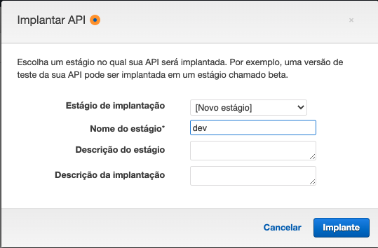

34.  Para fazer chamadas de teste clique em `Ações de estágio` e selecione `Exportar`. 
  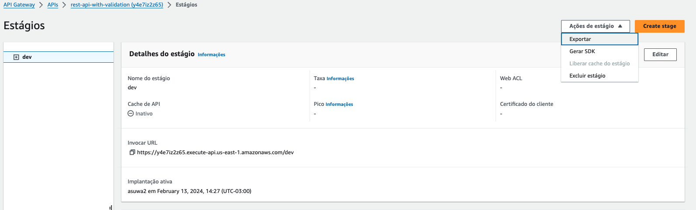
35. Selecione as seguintes opções e clique em `Exportar API`:
    1. Tipo de especificação de API: `Swagger`
    2. Formato: `YAML`
    3. Extensões: `Exportar com extensões Postman`
    
    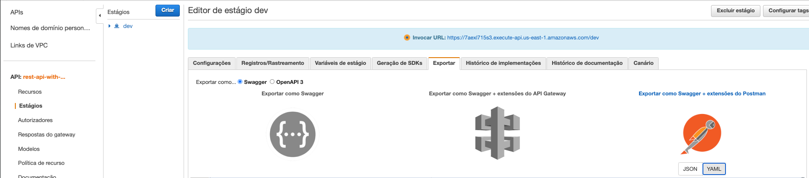
    > Esta ação irá baixar um arquivo com a extensão .yaml que é a especificação da sua API e um arquivo .json que é a coleção de chamadas para o Postman.
    
36. No [postman](https://go.postman.co/home) clique em `Import` e em `Upload Files` selecione o arquivo recem baixado.
    
    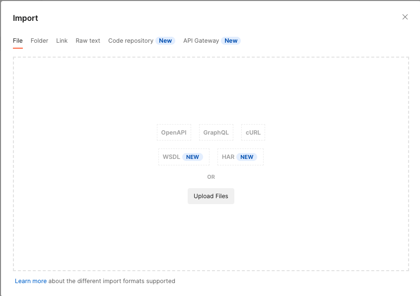

37. Clique em `Import` para finalizar a importação
   
    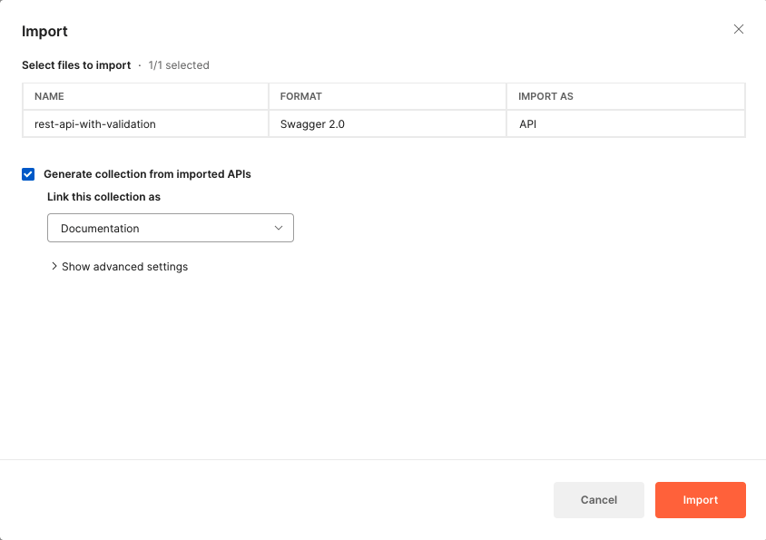

38. Na lateral esquerda do Postman clique em `Collections` e expanda `rest-api-with-validation` até conseguir clicar `POST /user/create`

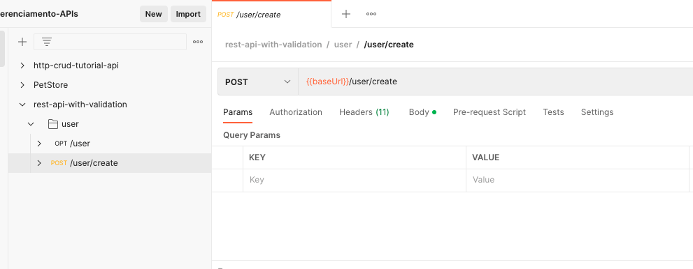

39. Clique em `Body` no centro da tela e substitua o json que aparece por:
``` json
{
    "name": "Jose Silva",
    "age": 43,
    "dateofregistry": "1989-10-13"
}
```
40.  Clique em `Send` na lateral direita e verá que a resposta apenas adiciona o campo Response ao objeto enviado. Isso aconteceu pois os campos foram vlaidados e aprovados.
    
  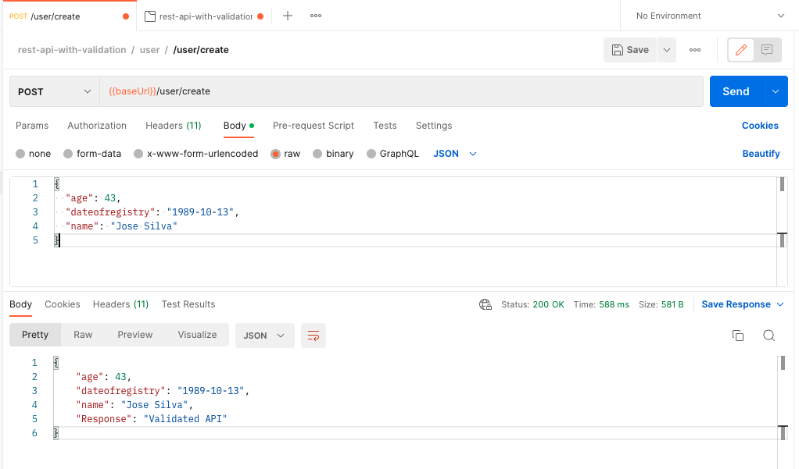

41. Altere o json que envia retirando o campo `age` e clique em `Send` para ver o comportamento de resposta da API.
    
    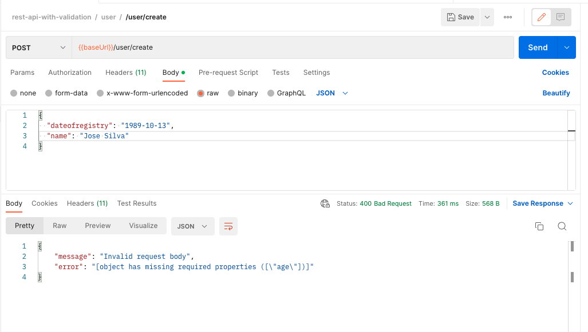

42. Faça testes com outros campos e formatos de envios para ver o comportamento das validações. Como por exemplo tentar colocar um mês com número acima de 12.
43. Devolta ao painel da sua récem criada api no API Gateway no navegador, clique em `Chaves de API` na lateral esquerda.
44. Clique em `Criar chave de API`
    
    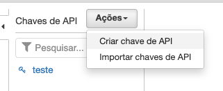

45. Preencha o campo nome com `usp-api` e clique em `Salvar`
    
    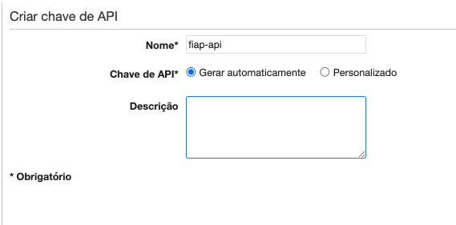

46. Clique em 'show' e copie o texto da chave de API para uso nos próximos passos

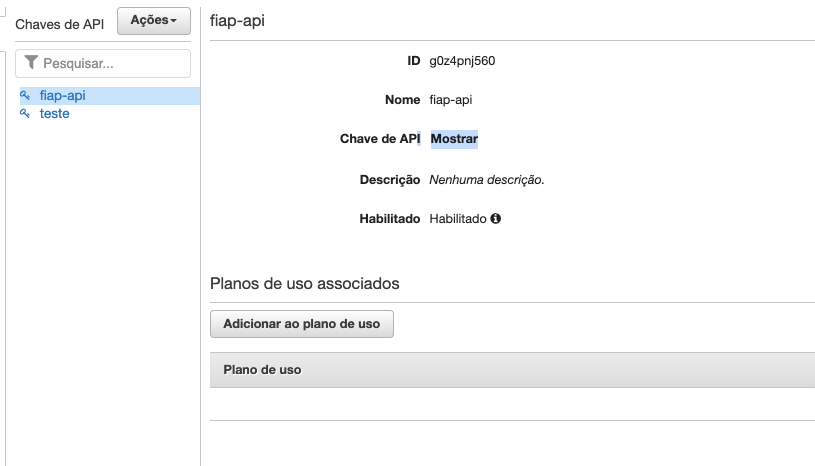

39. Na lateral esquerda clique em `Recursos` para voltar e editar os recursos da api rest-api-with-validation para que aceitem apenas chamadas com a chave inclusa.
40. Clique em `POST`, o método criado para o recurso create da API.
    
    
    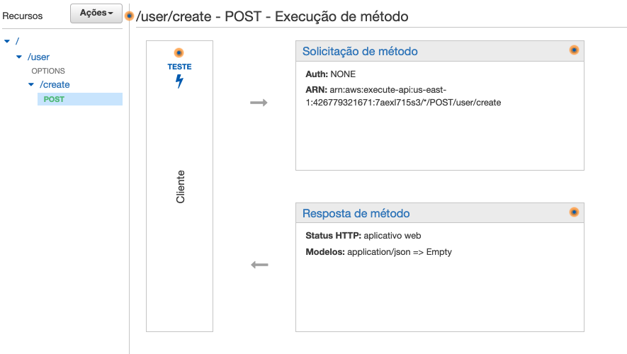

41. Clique em `Solicitação de método` e após `Editar`.
42. Selecione o `Chave de API obrigatória` e salve o check do final da linha.

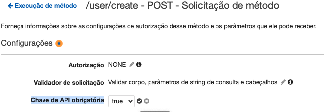

43.  Faça a implantação da API para fazer valer a alteração. Clique em `Implantar API`. Selecione o estágio `dev` e clique em `Implantar`.

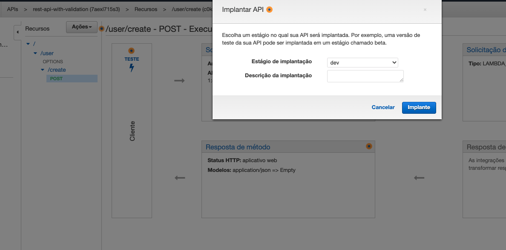

44. Agora é hora de criar o plano de uso da API e adicionar a chave recem criada como permitida. Para iniciar o processo, na lateral esquerda clique em `Planos de utilização`.
45. Clique em `Criar plano de uso`
    
    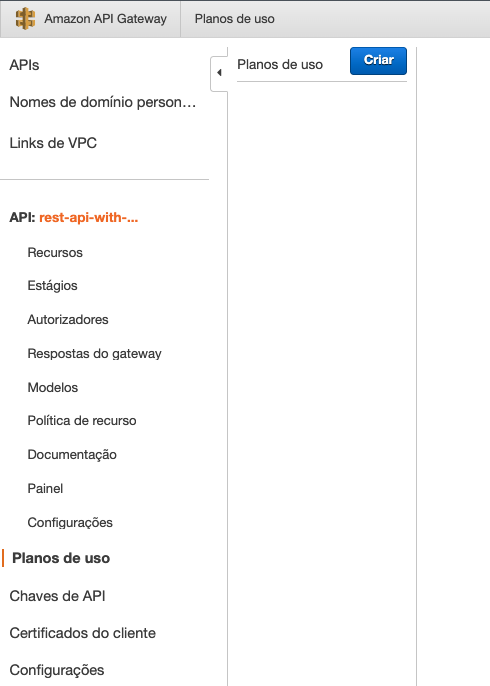

46. Preencha os campos conforme a descrição e clique em próximo:
    1. Nome: `api-validation-plan`
    2. Taxa: `1000`
    3. Pico: `1500`
    4. Requisições por mês: `100000`

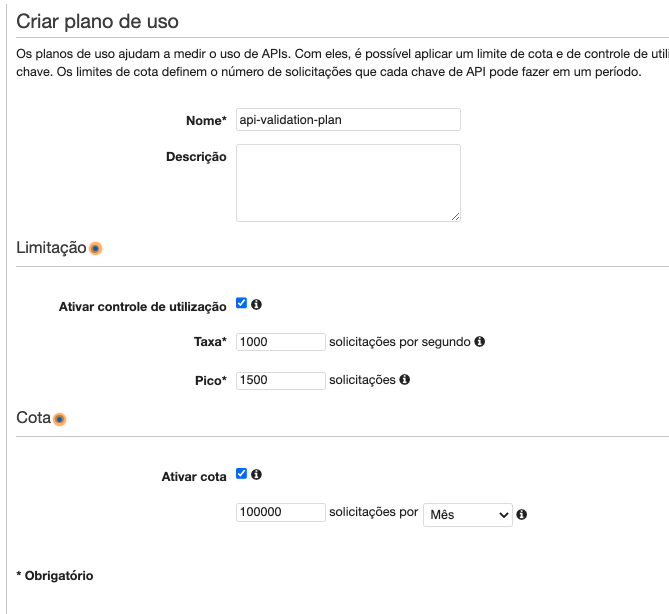

47. Clique em `Criar plano de uso`
48. Clique no plano de uso recém criado para abrir a página que utilizará para atribuir as APIs. 
49. Clique em `Adicionar estágio` no canto inferior direito da tela.
    
    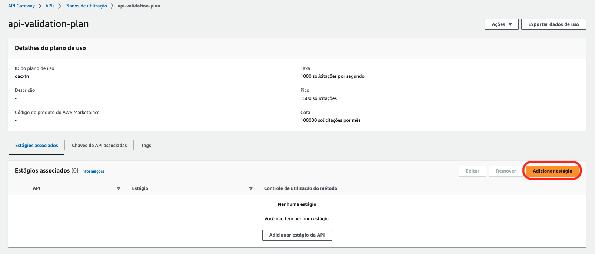

50. Preencha segundo a descrição e clique em `Adicionar ao plano de uso`:
    1.  API: `rest-api-with-validation`
    2.  Estágio: `dev`

  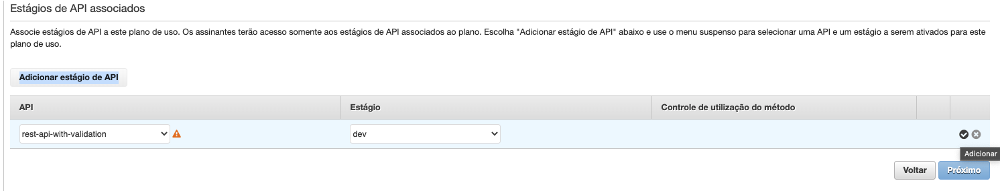
  
51. Clique na aba `Chaves de API associadas`
52. Clique em `Adicionar chave de API`
    
  

53.  Seleciona a chave `usp-api` e clique em `Adicionar chave de API`.
    
    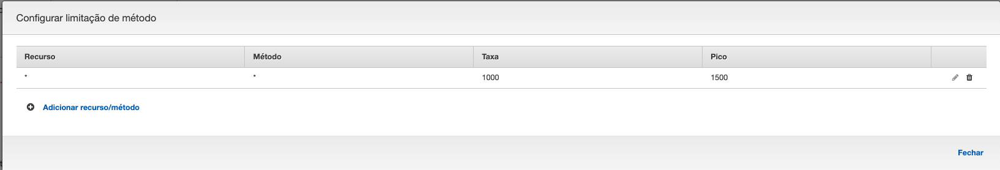

54. Agora vá até o Postman para testar. Na lateral esquerda clique em `Collections` e expanda `rest-api-with-validation` para clicar em `POST /user/create`
    
  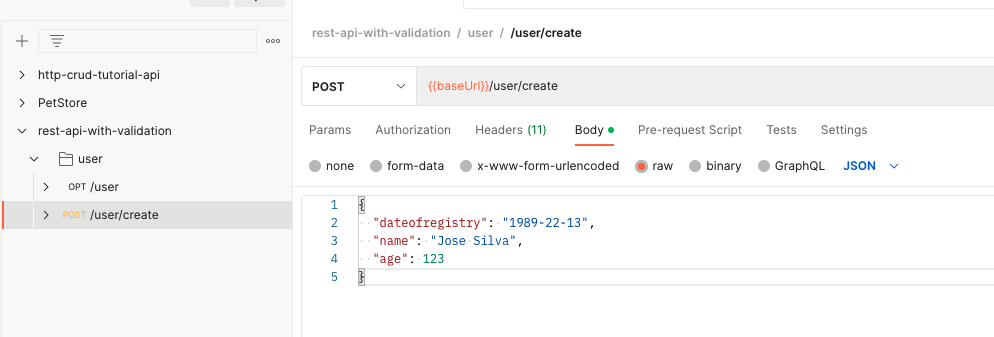

55.  Clique em `Send` na lateral direita superior para ver que não consegue mais fazer a chamada sem autorização.

  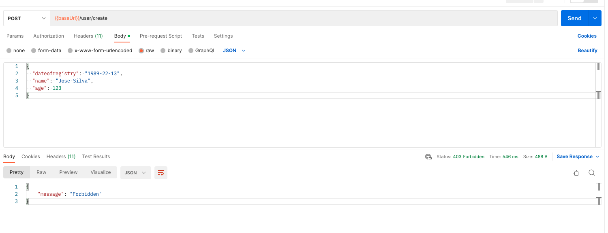

56.  No Postman, dentro do método `/user/create` clique na aba `Authorization` e selecione `API Key` no tipo de autorização.
    
  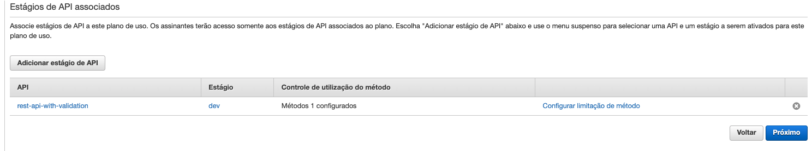

57. Adicione a Key `x-api-key` com o valor da chave que copiou no passo 42. Caso tenha perdido, acesse o [link](https://us-east-1.console.aws.amazon.com/apigateway/main/api-keys?region=us-east-1), clique em usp-api e mostrar.
    
  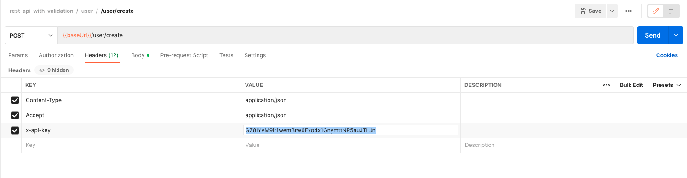

58.   Clique em `Save` na lateral direita superior do Postman.
59.   Clique em `Send` na lateral direita superior e note que a chamada foi bem sucedida por que adicionou o API Key.
      
  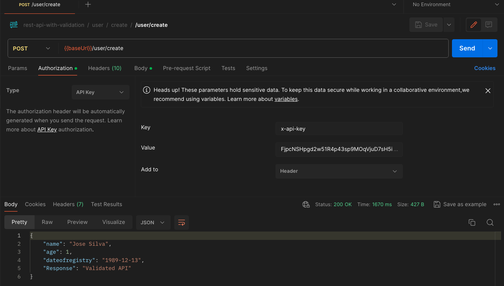