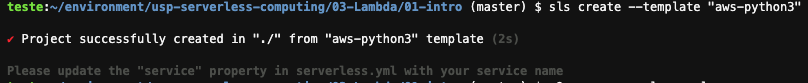
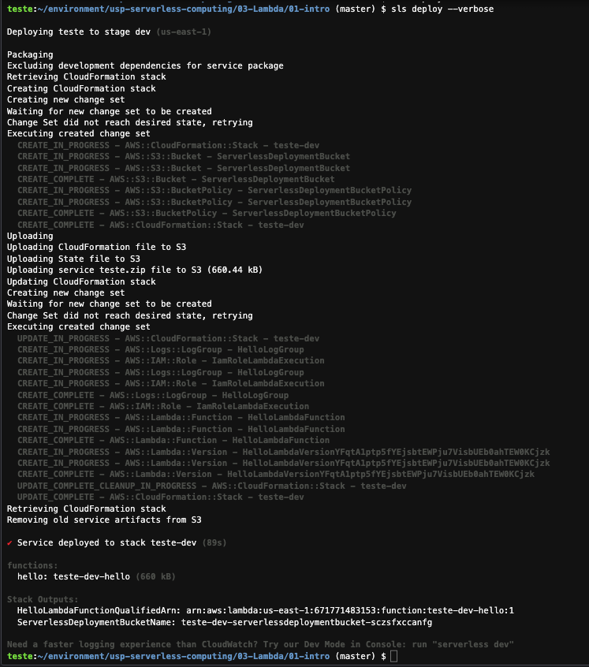
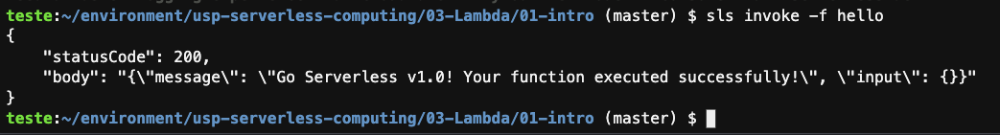
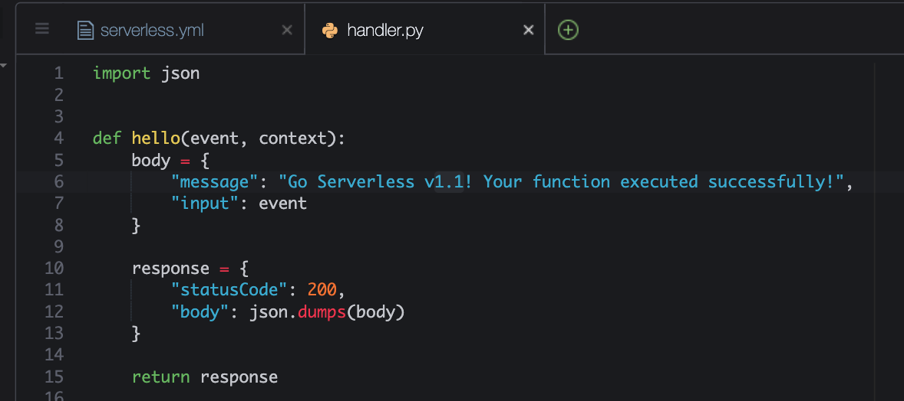
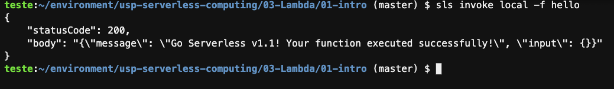
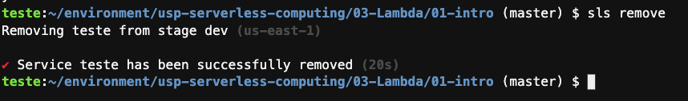

# Aula 03.1 - Lambda

1. No terminal do IDE criado no cloud9 execute o comando `cd ~/environment/usp-serverless-computing/03-Lambda/01-intro` para entrar na pasta que fara este exercicio.
2. Iniciar o repositório de trabalho `sls create --template "aws-python3"`

  

<blockquote>
`sls create --template "aws-python3"` é um comando do Serverless Framework, uma ferramenta para criar, implantar e gerenciar aplicações serverless.

- `sls`: Abreviação de `serverless`, refere-se ao comando de linha de comando (CLI) do Serverless Framework.
- `create`: Subcomando utilizado para criar um novo projeto serverless.
- `--template`: Opção que especifica o modelo (template) a ser utilizado para a criação do projeto.
- `"aws-python3"`: Nome do modelo que indica a criação de um projeto para a AWS (Amazon Web Services) utilizando Python 3 como linguagem de programação.

Este comando inicializa um novo projeto serverless com uma configuração básica para a AWS e um exemplo de função Lambda em Python 3, facilitando o início do desenvolvimento de aplicações serverless.

</blockquote>
3. Abra o arquivo serverless.yml no IDE com o comando `c9 open serverless.yml`
4. Altere o arquivo para que fique como na imagem abaixo. Para salvar utilize CTRL+S.
   
   

<blockquote>
  O arquivo `serverless.yml` é um documento de configuração usado pelo Serverless Framework para definir e implantar aplicações serverless. Aqui está uma análise detalhada de cada seção e campo do arquivo exemplo:

  - `service: teste`  
    Identifica o nome do serviço serverless. É uma maneira de agrupar todas as funções relacionadas em um único serviço chamado `teste`.

  - `frameworkVersion: '3'`  
    Define a versão do Serverless Framework que está sendo usada. A versão `3` é especificada para garantir que as funcionalidades e sintaxes corretas sejam aplicadas.

  **Seção do Provedor (`provider`):**  
  Configurações globais do provedor de nuvem para o serviço.

  - `name: aws`  
    Especifica a AWS como o provedor de nuvem onde o serviço será implantado.

  - `runtime: python3.11`  
    Define a runtime da função, nesse caso Python 3.11, determinando a linguagem de programação e a versão usada pelas funções Lambda.

  - `memorySize: 128`  
    A quantidade de memória alocada para cada função Lambda, medida em megabytes (MB). Aqui, cada função usará 128 MB.

  - `region: 'us-east-1'`  
    Determina a região da AWS onde o serviço será implantado, neste caso, `us-east-1`, que se refere ao Norte da Virgínia, EUA.

  - `timeout: 300`  
    O tempo máximo, em segundos, que uma função pode executar antes de ser automaticamente encerrada. Aqui, é definido para 300 segundos (5 minutos).

  **Seção de Funções (`functions`):**  
  Define as funções individuais que compõem o serviço.

  - `hello:`  
    Nome da função Lambda dentro do serviço serverless.

    - `handler: handler.hello`  
      Especifica o manipulador da função Lambda, que é a referência para o código que será executado quando a função for invocada. Neste caso, `handler.hello` refere-se a um arquivo chamado `handler.py` com uma função `hello` definida dentro dele.

  Este arquivo `serverless.yml` cria a estrutura para um serviço serverless na AWS, utilizando Python 3.11 como linguagem de programação, com uma função Lambda chamada `hello`. Ele define parâmetros importantes como a região de implantação, tamanho da memória, tempo de execução máximo e a função IAM que as funções Lambda irão assumir.
</blockquote>

6. No terminal do IDE faça deploy da função criada com o comando `sls deploy --verbose`. Esse comando vai mostrar cada etapa sendo feita em detalhes, bem como o status do cloudformation criado.
 
  
<blockquote>
  O comando `sls deploy --verbose` é usado no contexto do Serverless Framework, uma ferramenta popular para a implantação e gerenciamento de aplicações serverless em vários provedores de nuvem como AWS, Azure, Google Cloud, e outros.

  - `sls`: É a abreviação de `serverless`, o comando principal do Serverless Framework utilizado para executar diversas operações relacionadas a aplicações serverless.

  - `deploy`: Este subcomando é responsável por empacotar e implantar toda a aplicação serverless ou funções individuais especificadas para o provedor de nuvem configurado no `serverless.yml`. Ele gerencia a criação e atualização de recursos na nuvem, como funções Lambda, API Gateway, e outros recursos necessários para a execução da aplicação.

  - `--verbose`: Uma opção de linha de comando que habilita a saída detalhada durante o processo de implantação. Quando utilizado, o comando `sls deploy` fornecerá mais informações sobre o que está acontecendo durante a implantação, incluindo detalhes sobre os recursos que estão sendo criados ou atualizados na nuvem. Isso é particularmente útil para depuração ou para obter uma compreensão mais profunda das ações realizadas pelo Serverless Framework.

  Utilizar `sls deploy --verbose` é uma prática recomendada quando se busca mais transparência sobre o processo de implantação ou quando se encontra problemas, pois os logs detalhados podem ajudar a identificar a causa de eventuais falhas ou a entender melhor os recursos que estão sendo manipulados pelo framework.

</blockquote>

7. Testar remotamente a função `sls invoke -f hello`

  

<blockquote>
  O comando `sls invoke -f hello` é utilizado no contexto do Serverless Framework para invocar uma função específica de uma aplicação serverless diretamente da linha de comando.

  - `invoke`: Este subcomando é usado para invocar uma função Lambda que já foi implantada no provedor de nuvem. A invocação é feita de maneira isolada, permitindo testar ou executar a função diretamente, sem a necessidade de acioná-la através dos seus gatilhos usuais (como eventos HTTP ou eventos de serviços da AWS).

  - `-f hello`: A opção `-f` (ou `--function`) especifica o nome da função que será invocada. Neste caso, `hello` indica que a função chamada `hello` será a função invocada. O nome deve corresponder ao nome de uma função definida no arquivo `serverless.yml` da aplicação.

  Utilizar o comando `sls invoke -f hello` é uma maneira conveniente de testar funções Lambda individualmente após a implantação, permitindo verificar o comportamento e a resposta da função sem a necessidade de acionar os eventos que normalmente a invocariam em um ambiente de produção. Isso facilita a depuração e o desenvolvimento ao permitir avaliações rápidas de mudanças e ajustes no código da função.
</blockquote>

8. Execute o comando `c9 open handler.py` e altere a versão do retorno da função para 1.1 no arquivo "handler.py" como na imagem e salve com as teclas "CTRL + S"
  
  

9.  Faça um teste local da sua função no terminal com o comando `sls invoke local -f hello` 
  
  

<blockquote>
  O comando `sls invoke local -f hello` é utilizado no contexto do Serverless Framework para invocar uma função Lambda localmente, sem a necessidade de implantá-la no provedor de nuvem.

  - `invoke`: Este subcomando é usado para invocar uma função Lambda que já foi implantada no provedor de nuvem. A invocação é feita de maneira isolada, permitindo testar ou executar a função diretamente, sem a necessidade de acioná-la através dos seus gatilhos usuais (como eventos HTTP ou eventos de serviços da AWS).

  - `local`: A opção `local` indica que a invocação será feita localmente, ou seja, a função será executada no ambiente de desenvolvimento do usuário, sem a necessidade de implantá-la na nuvem.

  - `-f hello`: A opção `-f` (ou `--function`) especifica o nome da função que será invocada. Neste caso, `hello` indica que a função chamada `hello` será a função invocada. O nome deve corresponder ao nome de uma função definida no arquivo `serverless.yml` da aplicação.

  Utilizar o comando `sls invoke local -f hello` é uma maneira conveniente de testar funções Lambda individualmente durante o desenvolvimento, permitindo verificar o comportamento e a resposta da função sem a necessidade de acionar os eventos que normalmente a invocariam em um ambiente de produção. Isso facilita a depuração e o desenvolvimento ao permitir avaliações rápidas de mudanças e ajustes no código da função.
</blockquote>

10. Para deletar a função que esta no lambda utilize o comando `sls remove`
  
  

<blockquote>
  O comando `sls remove` é utilizado no contexto do Serverless Framework para remover todos os recursos da aplicação serverless do provedor de nuvem.

  - `remove`: Este subcomando é usado para desfazer a implantação de uma aplicação serverless, removendo todos os recursos que foram criados durante o processo de implantação. Isso inclui funções Lambda, API Gateway, tabelas do DynamoDB, filas do SQS, e outros recursos que foram criados como parte da aplicação.

  Utilizar o comando `sls remove` é uma prática recomendada para limpar os recursos da nuvem após o término do desenvolvimento, testes ou uso de uma aplicação serverless. Isso evita a geração de custos desnecessários e mantém o ambiente de nuvem organizado, removendo recursos que não estão mais em uso.
</blockquote> 
