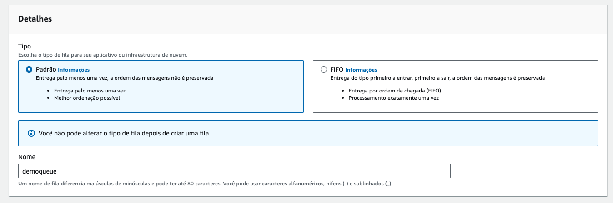
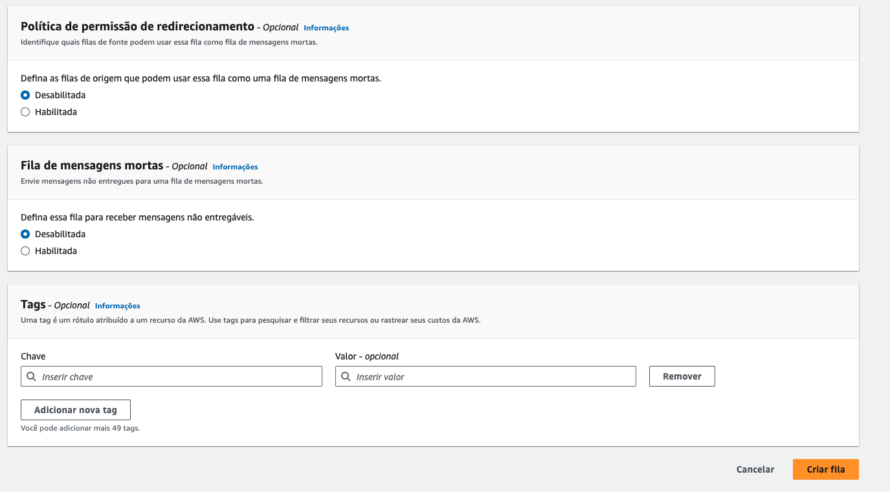
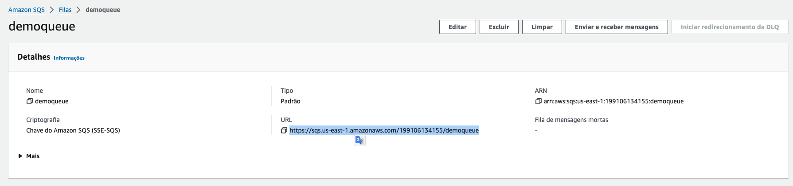
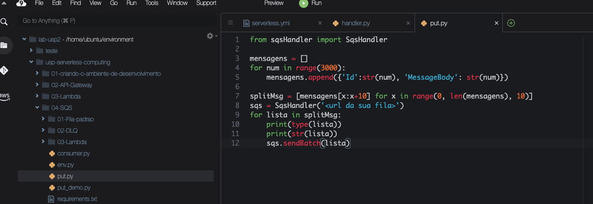
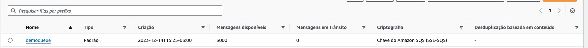
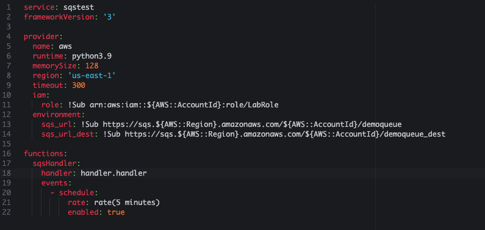
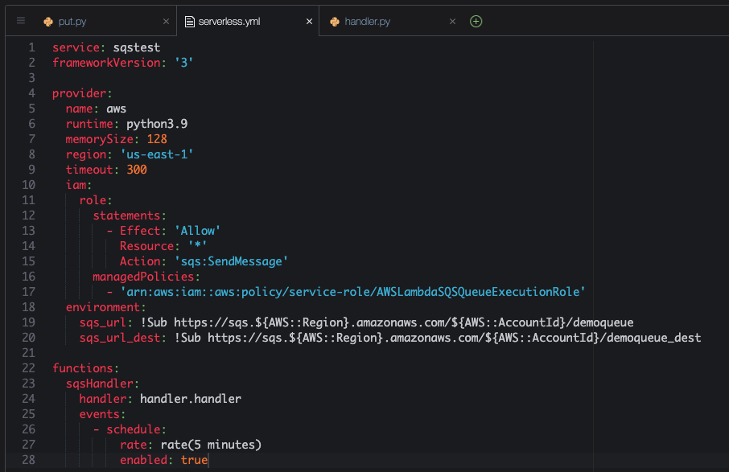
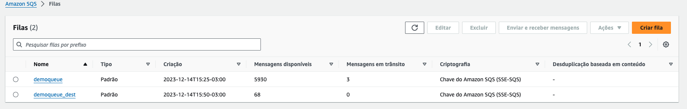
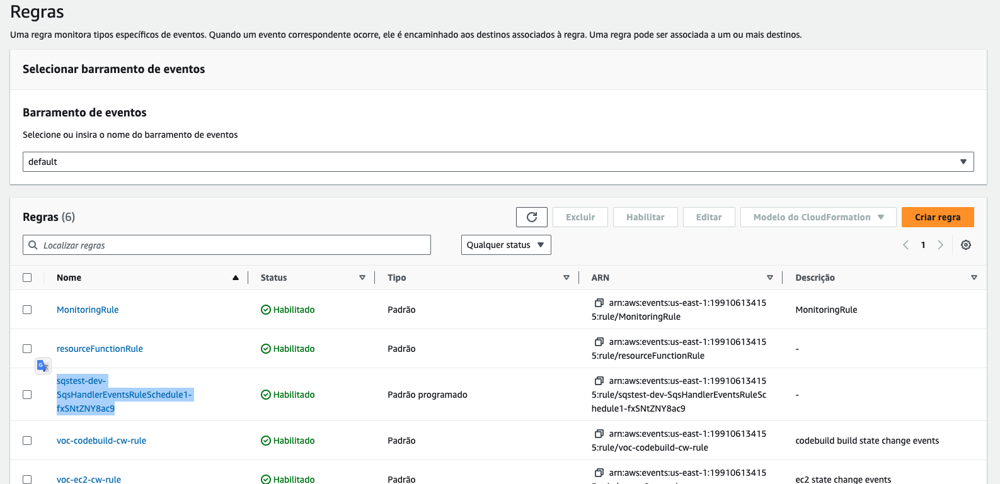
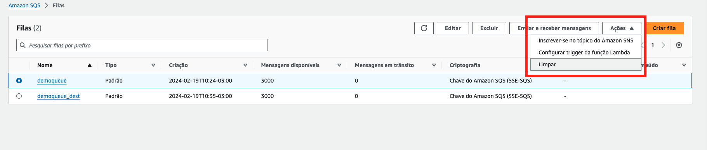

# Aula 04.1 - Fila Padrão


<blockquote>
O Amazon Simple Queue Service (SQS) é um serviço de mensageria totalmente gerenciado que permite a integração de componentes de software de maneira fácil e segura, em qualquer volume, sem perder mensagens e sem a necessidade de outros serviços para manter a infraestrutura ativa. O SQS oferece dois tipos de filas: Standard e FIFO (First-In-First-Out).

- **Fila padrão**: As filas Standard oferecem throughput máximo, melhor desempenho e entrega de mensagens na ordem em que são enviadas (best-effort ordering). No entanto, ocasionalmente, uma mensagem pode ser entregue mais de uma vez e a ordem de entrega não é garantida. Essas filas são projetadas para serem altamente disponíveis e escaláveis, proporcionando um caminho robusto para a comunicação entre componentes de aplicativos de forma desacoplada.

- **Características principais**:
  - **Throughput ilimitado**: Não há limitação no número de transações por segundo.
  - **Entrega de mensagem no mínimo uma vez**: As mensagens são entregues pelo menos uma vez, mas podem ser entregues mais de uma vez.
  - **Ordenação de mensagens**: A fila tenta manter a ordem das mensagens, mas não é garantido que as mensagens serão recebidas na exata ordem em que foram enviadas.
  - **Escalabilidade e disponibilidade**: O SQS escala automaticamente para lidar com qualquer volume de mensagens, garantindo alta disponibilidade.

As filas Standard do SQS são ideais para situações em que o volume de mensagens é alto e um nível de tolerância a duplicatas e ordenação flexível é aceitável. Isso as torna adequadas para uma ampla gama de aplicações, desde processos de background em sistemas de TI até sistemas de comunicação em tempo real que necessitam de alta performance e escalabilidade.
</blockquote>

### Criando a fila sqs

1. [Crie uma fila](https://us-east-1.console.aws.amazon.com/sqs/v3/home?region=us-east-1#/create-queue) no sqs colocando o nome 'demoqueue', deixe os valores default e clique em 'Criar Fila'
    

    

2. Copie a URL da sua fila que esta disposta conforme imagem:
    

### Enviando dados para a fila

1. De volta ao terminal do Cloud9 IDE, execute o comando `cd ~/environment/usp-serverless-computing/` seguido do comando `git pull origin master` para atualizar o repositório.
2. Execute o comando `cd ~/environment/usp-serverless-computing/04-SQS/01-Fila-padrao/` para entrar na pasta que fara este exercicio.
3. Abra o arquivo put.py com o comando `c9 open put.py`
4. Altere o arquivo put.py adicionando a URL da fila do sqs que criou nos passos anteriores

    

5. Execute os comandos abaixo para garantir que esta em um ambiente virtual do python com as dependencias necessárias para executar o execício:

   ``` shell
   pip3 install virtualenv && python3 -m venv ~/venv
   source ~/venv/bin/activate
   pip3 install boto3
   npm install -g serverless
   ```

6. Execute o comando `python3 put.py` no terminal para colocar 3000 mensagens na fila. Verifique no [console](https://us-east-1.console.aws.amazon.com/sqs/v3/home?region=us-east-1#/queues) o resultado do comando.


### Consumindo SQS

<blockquote>
Para consumir mensagens de uma fila SQS Standard sem utilizar AWS Lambda, você pode seguir estes passos, levando em consideração que o ambiente para acessar a AWS já está configurado (isto é, as credenciais da AWS estão configuradas e você tem acesso programático ao SQS):

**1. Escolha um SDK AWS**: Primeiro, escolha o SDK da AWS na linguagem de programação de sua preferência (por exemplo, AWS SDK para Python (Boto3), Java, Node.js, etc.). Este SDK facilitará a interação com o SQS.

**2. Inicialize o cliente SQS**: Utilize o SDK para inicializar um cliente SQS. Isso geralmente envolve importar o SDK, configurar a região e, se necessário, as credenciais de acesso.

**Exemplo em Python com Boto3**:
```python
import boto3

# Inicializa o cliente SQS
sqs = boto3.client('sqs', region_name='sua-regiao')
```

**3. Receba mensagens da fila**: Use o cliente SQS para receber mensagens da fila. Você pode especificar o número de mensagens a serem recebidas (até 10 por vez) e o tempo de espera (long polling) para reduzir o número de chamadas de API vazias.

**Exemplo em Python com Boto3**:
```python
queue_url = 'URL-da-sua-fila-SQS'

# Recebe mensagens
response = sqs.receive_message(
    QueueUrl=queue_url,
    MaxNumberOfMessages=10,
    WaitTimeSeconds=20  # Long polling
)
```

**4. Processar as mensagens recebidas**: Após receber as mensagens, você pode processá-las conforme necessário. Isso pode incluir desempacotar os dados da mensagem, executar uma tarefa e registrar o resultado.

**5. Apagar a mensagem da fila**: Após processar uma mensagem com sucesso, certifique-se de apagá-la da fila para evitar que ela seja recebida e processada novamente. Para isso, você precisará do `ReceiptHandle` da mensagem.

**Exemplo em Python com Boto3**:
```python
if 'Messages' in response:
    for message in response['Messages']:
        # Processa a mensagem
        print("Mensagem: ", message['Body'])
        
        # Apaga a mensagem da fila
        sqs.delete_message(
            QueueUrl=queue_url,
            ReceiptHandle=message['ReceiptHandle']
        )
```

**Considerações importantes**:

- **Tratamento de erros**: Implemente tratamento de erros adequado para lidar com possíveis exceções, como mensagens que não podem ser processadas.
- **Visibilidade Timeout**: Ao receber uma mensagem, ela não é removida da fila, mas fica invisível para outros consumidores por um período (o "visibility timeout"). Se a mensagem não for apagada neste período, ela se tornará visível novamente e poderá ser recebida por outro consumidor. Ajuste o `VisibilityTimeout` conforme necessário.
- **Concorrência**: Se estiver operando em um ambiente com múltiplos consumidores, considere as implicações da concorrência no processamento de mensagens.
- **Monitoramento**: Monitore as operações de sua fila SQS para otimizar o desempenho e os custos, utilizando ferramentas como o Amazon CloudWatch.

Seguindo esses passos, você poderá consumir mensagens de uma fila SQS Standard de forma eficaz, sem a utilização de AWS Lambda.
</blockquote>

1. [Crie mais uma fila](https://us-east-1.console.aws.amazon.com/sqs/v3/home?region=us-east-1#/create-queue) sqs utilizando o mesmo procedimento do exercicio anterior com o mesmo nome da anterior com o sulfixo '_dest', ficará `demoqueue_dest`
2. Execute o comando no terminal do cloud 9 `sls create --template "aws-python3"`
3. Abra o arquivo serverless.yml com o comando `c9 open serverless.yml`
4. Altere o arquivo 'serverless.yml' e coloque o seguinte conteudo, não esqueça de preencher as duas URLs das filas como descrito:



<blockquote>
O código fornecido é uma configuração para o Serverless Framework, uma ferramenta popular para construir e implantar aplicações serverless, como funções AWS Lambda. Este arquivo de configuração define uma aplicação chamada `sqstest` com várias especificações para o ambiente de execução, permissões IAM, variáveis de ambiente e funções Lambda. Vamos detalhar cada seção do arquivo:

**service: sqstest**  
Esta linha define o nome do serviço como `sqstest`. O nome do serviço é usado para agrupar todos os recursos relacionados no AWS CloudFormation.

**frameworkVersion: '3'**  
Especifica a versão do Serverless Framework utilizada, que neste caso é a versão `3`.

**provider:**  
Esta seção configura o provedor de serviços de nuvem, que neste caso é a AWS (`name: aws`). Ela inclui várias configurações específicas para a execução das funções Lambda, como:

- **runtime: python3.9**: Define o ambiente de execução das funções Lambda como Python 3.9.
- **memorySize: 128**: Aloca 128 MB de memória para a execução das funções Lambda.
- **region: 'us-east-1'**: Especifica que os recursos serão implantados na região `us-east-1` da AWS.
- **timeout: 300**: Configura o tempo máximo de execução (timeout) para as funções Lambda como 300 segundos (5 minutos).
- **iam:**  
    - **role:** Define as políticas de permissão para a função Lambda, permitindo que ela envie mensagens para qualquer fila SQS (`sqs:SendMessage`), e inclui uma política gerenciada (`AWSLambdaSQSQueueExecutionRole`) que oferece permissões adicionais necessárias para a execução da função com filas SQS.
- **environment:**  
    Define variáveis de ambiente para as funções Lambda. Neste caso, `sqs_url` e `sqs_url_dest` são URLs para filas SQS específicas, construídas dinamicamente usando a função `!Sub` para incluir a região da AWS e o ID da conta.

**functions:**  
Esta seção define as funções que fazem parte do serviço. Neste caso, há uma função:

- **sqsHandler:**  
    - **handler: handler.handler**: Especifica o arquivo e o método de manipulação (`handler.py` e a função `handler`) que será invocado quando a função Lambda for executada.
    - **events:**  
        - **schedule:**  
            - **rate: rate(5 minutes)**: Define um gatilho baseado em tempo para a função, configurando-a para ser executada a cada 5 minutos.
            - **enabled: true**: Habilita o gatilho de agendamento, garantindo que a função seja executada conforme especificado.

Este arquivo de configuração do Serverless Framework automatiza o processo de configuração e implantação de funções Lambda na AWS, incluindo permissões necessárias, gatilhos de execução e variáveis de ambiente, facilitando o desenvolvimento e a manutenção de aplicações serverless.
</blockquote>

5. Altere o arquivo 'handler.py' com o seguinte conteudo. O abra com o seguinte comando `c9 open handler.py`



<blockquote>
Este código em Python define uma função `handler` que é projetada para ser usada como uma função de manipulação de eventos, em um ambiente AWS Lambda, para ler mensagens de uma fila do Amazon SQS, processá-las de alguma forma e então encaminhá-las para outra fila do SQS. Abaixo está a explicação detalhada de cada parte do código:

- **Imports**:
  - `from sqsHandler import SqsHandler`: Importa a classe `SqsHandler` de um módulo chamado `sqsHandler`. Essa classe é  responsável por encapsular a lógica de interação com uma fila do Amazon SQS, como enviar, receber e deletar mensagens.
  - `from env import Variables`: Importa a classe `Variables` de um módulo chamado `env`. Esta classe provavelmente é usada para acessar variáveis de ambiente ou configurações específicas, como URLs das filas SQS.
  - `import json`: Importa o módulo `json` que é usado para trabalhar com dados no formato JSON, permitindo codificar e decodificar dados nesse formato.

- **Definição da função handler**:
  - `def handler(event, context):` define a função `handler` que aceita dois parâmetros: `event` e `context`. Esses parâmetros são padrão em funções Lambda, onde `event` contém informações sobre o evento que disparou a função, e `context` fornece informações sobre o ambiente de execução da função.

- **Inicialização de variáveis e objetos SQS**:
  - `env = Variables()`: Cria uma instância da classe `Variables` para acessar configurações.
  - `sqs = SqsHandler(env.get_sqs_url())`: Cria uma instância da classe `SqsHandler` para interagir com a fila SQS de origem, usando a URL obtida através do método `get_sqs_url` da instância `env`.
  - `sqs_dest = SqsHandler(env.get_sqs_url_dest())`: Semelhante ao acima, mas cria um manipulador para a fila SQS de destino, usando a URL obtida por `get_sqs_url_dest`.

- **Processamento de mensagens**:
  - O loop `for i in range(100):` inicia um loop que tentará processar mensagens até 100 vezes.
  - `msgs = sqs.getMessage(10)`: Chama o método `getMessage` do objeto `sqs` para tentar receber até 10 mensagens da fila de origem.
  - `print(json.dumps(msgs))`: Imprime as mensagens recebidas no formato JSON.
  - Os `if` subsequentes verificam se não há mensagens para processar, interrompendo o loop se `msgs` não contiver uma chave `'Messages'` ou se o array de mensagens estiver vazio.

- **Encaminhamento e deleção de mensagens**:
  - Dentro do loop `for message in msgs['Messages']:` itera sobre cada mensagem recebida.
  - `sqs_dest.send(json.dumps(message['Body']))`: Envia o corpo da mensagem (codificado em JSON) para a fila de destino.
  - `sqs.deleteMessage(message['ReceiptHandle'])`: Deleta a mensagem da fila de origem, usando o `ReceiptHandle` da mensagem para identificá-la. Isso é importante para garantir que a mensagem não seja processada novamente.

Este código efetua uma ponte entre duas filas SQS, transferindo mensagens de uma fila de origem para uma fila de destino após processamento, que neste caso é simplesmente o reenvio da mensagem. Isso pode ser útil em cenários onde é necessário processar ou filtrar mensagens antes de encaminhá-las para seu destino final.
</blockquote>

1. rode o comando `sls deploy`
2. Coloque alguns itens na fila com o comando `python3 put.py`, lembrando que cada execução do lambda criado pode consumir até 1000 posições da fila sqs.
3. Para execução do lambda rode o comando `sls invoke -l -f sqsHandler` no terminal
4.  Enquando espera o comando terminar pode observar no painel do SQS as mensagens se movendo a cada atualização manual pelo canto direito superior. Lembre que cada execução move 1000 por definição no código. [Link para painel SQS](https://console.aws.amazon.com/sqs/v2/home?region=us-east-1#/queues)

    

5.  Vá até o painel de [regras do cloudwath](https://us-east-1.console.aws.amazon.com/events/home?region=us-east-1#/rules?redirect_from_cwe=true) que verá a regra de execução baseada em tempo criada com o serverless framework. A regra tem nome iniciado em `sqstest`



11.   Se esperar alguns execuções vai ver que a fila principal vai zerar.
12. Execute o comando `sls remove` no terminal para remover o que foi criado.
13. Vamos apagar as mensagens que ainda estão nas filas do SQS. Para isso acesse o painel do [SQS](https://us-east-1.console.aws.amazon.com/sqs/v2/home?region=us-east-1#/queues) e selecione primeiro a fila `demoqueue` e clique em `Ações` e  clique em `Limpar`. 
    
    

14. Digite `limpar` como pedido e clique em `Limpar`
    
    

15. Execute o mesmo processo para a fila `demoqueue_dest`.
