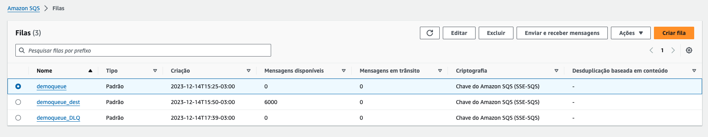
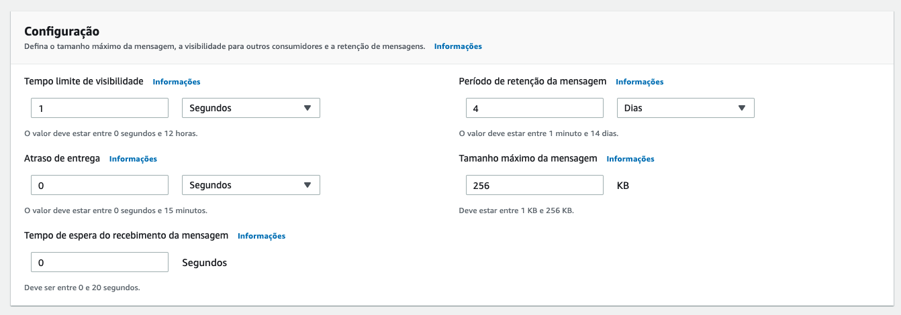
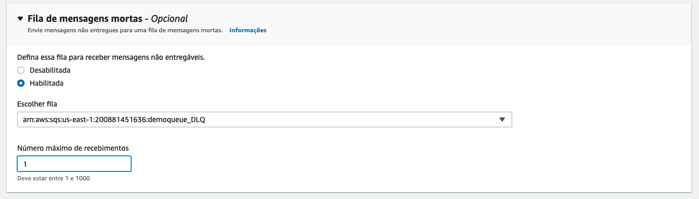
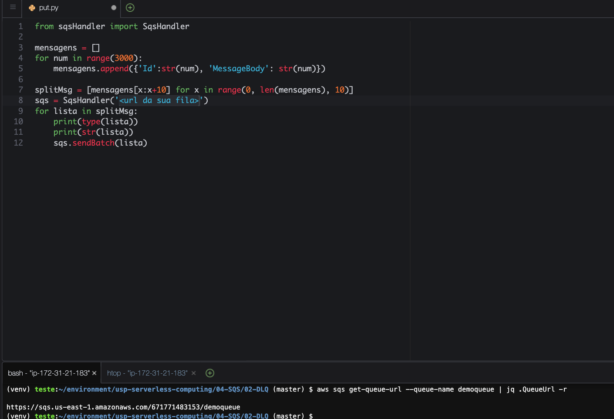
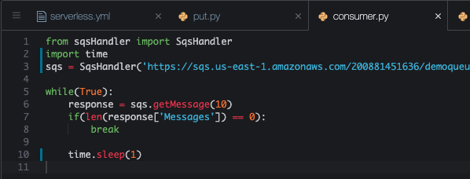
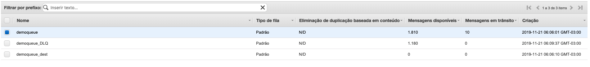

# Aula 04.2 - DLQ Queue

<blockquote>
A função DLQ (Dead Letter Queue) de uma fila SQS (Simple Queue Service) da AWS é um mecanismo que permite coletar mensagens que não puderam ser processadas com sucesso por uma fila SQS principal. Em outras palavras, uma DLQ é uma fila secundária onde as mensagens que falham repetidamente em ser processadas na fila principal são enviadas automaticamente após excederem o número configurado de tentativas de processamento.

**Funcionalidade da DLQ:**

Quando uma mensagem é recebida por uma aplicação a partir de uma fila SQS e, por algum motivo, não pode ser processada corretamente (por exemplo, devido a um erro de lógica de programação, falha de sistema externo, ou qualquer outra exceção), ela é devolvida à fila para ser tentada novamente. Se uma mensagem falha em ser processada mais vezes do que o limite configurado de reentregas, a AWS automaticamente a move para a DLQ associada. Isso é feito para evitar que mensagens problemáticas bloqueiem a fila principal e permitir uma investigação posterior sobre por que essas mensagens não puderam ser processadas.

**Vantagens de utilizar a DLQ:**

1. **Gerenciamento de falhas**: A DLQ oferece uma forma robusta de lidar com mensagens que por algum motivo não podem ser processadas, permitindo que o sistema continue operando suavemente ao isolar as mensagens problemáticas.

2. **Simplificação do processo de depuração**: Ter as mensagens que falharam em um local específico facilita a análise e a correção de problemas no código ou na lógica de processamento, pois você sabe exatamente quais mensagens precisam de atenção.

3. **Aumento da durabilidade das mensagens**: A DLQ garante que as mensagens que não foram processadas não sejam simplesmente perdidas. Isso é crucial para aplicações que requerem um alto grau de confiabilidade e integridade dos dados.

4. **Prevenção de bloqueio da fila principal**: Ao redirecionar mensagens problemáticas para uma DLQ, a fila principal fica livre para continuar processando novas mensagens sem atrasos, mantendo o fluxo de trabalho eficiente.

5. **Facilita a automação**: Você pode configurar alertas ou processos automáticos que são acionados quando mensagens são enviadas para a DLQ, permitindo uma resposta rápida a problemas.

6. **Flexibilidade na política de tentativas**: A configuração de uma DLQ permite definir políticas específicas de quantas vezes uma mensagem deve ser tentada antes de ser considerada como falha, permitindo um controle mais fino sobre o processamento de mensagens.

Utilizar uma DLQ em conjunto com filas SQS é uma prática recomendada para aplicações que precisam garantir o processamento confiável de mensagens e uma gestão eficiente de erros, contribuindo significativamente para a resiliência e a estabilidade do sistema.
</blockquote>

1. No terminal do IDE criado no cloud9 execute o comando `cd ~/environment/usp-serverless-computing/04-SQS/02-DLQ/` para entrar na pasta que fara este exercicio.
2. Na [aba do SQS](https://us-east-1.console.aws.amazon.com/sqs/v3/home?region=us-east-1#/create-queue) crie uma fila com o mesmo nome de uma fila já criada e coloque o sulfixo '_DLQ', ficará `demoqueue_DLQ`. Mantenha todo o restante das informação com o que esta pré preenchido.
3. De volta ao painel de [listagem de filas do SQS](https://us-east-1.console.aws.amazon.com/sqs/v3/home?region=us-east-1#/queues), selecione a fila `Demoqueue` clique em `Editar` no canto superior direito

  

4. Preencha as informações como nas imagens, e clique me 'Salvar'. Na primeira você esta alterando o tempo de visibilidade para 1 segundo para que a mensagem volte para fila 1 segundo após ter sido entregue a um consumidor e não retirada da fila nesse meio tempo. A segunda configuração, você esta adicionando a demoqueue_DLQ como fila de mensagem mortas e configurando para que mensagens entregues mais de uma vez sejam enviadas a ela.

  
  

5. Devolta ao Cloud9 IDE, altere o arquivo put.py colocando a URL da fila demoqueue nele, para abrir utilize `c9 open put.py` no terminal do cloud9. Para pegar a URL você pode entrar no console do SQS ou através do comando `aws sqs get-queue-url --queue-name demoqueue | jq .QueueUrl -r`
   
  

<blockquote>
O código em Python demonstra como enviar um grande número de mensagens para uma fila do Amazon SQS (Simple Queue Service) em lotes, utilizando uma classe personalizada `SqsHandler` para abstrair a lógica de interação com o SQS. O processo é dividido em várias etapas principais:

1. **Importação da classe `SqsHandler`**: 
   - `from sqsHandler import SqsHandler`: Esta linha importa a classe `SqsHandler` de um módulo chamado `sqsHandler`. Presume-se que esta classe tenha métodos para interagir com o Amazon SQS, incluindo um método para enviar mensagens em lote.

2. **Preparação da lista de mensagens**:
   - Inicializa uma lista vazia chamada `mensagens`.
   - Utiliza um loop `for` para criar 3000 mensagens. Cada mensagem é um dicionário contendo dois pares chave-valor: `'Id'`, que é uma string representando o número da iteração, e `'MessageBody'`, que também é uma string representando o mesmo número.
   - Essas mensagens são adicionadas à lista `mensagens`.

3. **Divisão da lista de mensagens em lotes**:
   - `splitMsg = [mensagens[x:x+10] for x in range(0, len(mensagens), 10)]`: Esta linha de código divide a lista `mensagens` em sub-listas (ou lotes) de 10 mensagens cada. Isso é feito utilizando list comprehension e slicing. O slicing `mensagens[x:x+10]` cria uma sub-lista começando no índice `x` até `x+10`, e o loop `for` itera sobre a lista original em passos de 10.

4. **Inicialização do `SqsHandler`**:
   - `sqs = SqsHandler('https://sqs.us-east-1.amazonaws.com/account-id/demoqueue')`: Cria uma instância da classe `SqsHandler`, passando a URL da fila SQS como argumento. Esta instância é usada para interagir com a fila especificada.

5. **Envio das mensagens em lotes para a fila SQS**:
   - Um loop `for` itera sobre a lista `splitMsg`, que contém as mensagens divididas em lotes de 10.
   - Dentro do loop, o tipo da sub-lista atual (`lista`) é impresso, seguido pela representação em string dessa sub-lista. Isto serve principalmente para propósitos de depuração ou monitoramento, permitindo que o desenvolvedor veja o conteúdo de cada lote enviado.
   - `sqs.sendBatch(lista)`: Este método da instância `sqs` é chamado para enviar o lote atual de mensagens (`lista`) para a fila SQS. Assume-se que o método `sendBatch` está implementado na classe `SqsHandler` para aceitar uma lista de mensagens e enviar todas elas como um único lote para a fila SQS, otimizando o processo de envio e potencialmente reduzindo custos e latência comparado ao envio de mensagens individualmente.

Este código é útil para casos de uso onde um grande volume de mensagens precisa ser enviado para uma fila SQS de maneira eficiente, utilizando o envio em lote para melhorar a performance e reduzir o número de chamadas à API do SQS.
</blockquote>

6. execute o comando `python3 put.py` no terminal
7. Faça as alterações no arquivo consumer.py(`c9 open consumer.py`)conforme a imagem a baixo, não esquecendo de colocar sua URL da demoqueue:

  
<blockquote>
O código em Python ilustra um processo contínuo que consome mensagens de uma fila do Amazon Simple Queue Service (SQS) usando uma classe personalizada chamada `SqsHandler`. Este processo busca mensagens na fila especificada e continua fazendo isso até que não haja mais mensagens para consumir. Aqui está a explicação detalhada de cada parte do código:

- **Importações**:
  - `from sqsHandler import SqsHandler`: Importa a classe `SqsHandler` de um módulo chamado `sqsHandler`. Esta classe é responsável por abstrair operações comuns do SQS, como enviar e receber mensagens.
  - `import time`: Importa o módulo `time`, que fornece várias funções relacionadas ao tempo, incluindo `sleep` para fazer a thread atual suspender a execução por um determinado número de segundos.

- **Inicialização do `SqsHandler`**:
  - `sqs = SqsHandler('https://sqs.us-east-1.amazonaws.com/671771483153/demoqueue')`: Cria uma instância da classe `SqsHandler`, passando a URL da fila SQS como argumento. Essa instância é usada para interagir com a fila `demoqueue`.

- **Processo de consumo de mensagens**:
  - `while(True):`: Inicia um loop infinito. Este padrão é comum em consumidores de fila que devem operar continuamente ou até que uma condição específica seja atendida.
  
  - **Recebimento de mensagens**:
    - `response = sqs.getMessage(10)`: Chama o método `getMessage` do objeto `sqs`, solicitando até 10 mensagens da fila. O método `getMessage` deve estar implementado na classe `SqsHandler` para fazer uma solicitação ao SQS e retornar as mensagens disponíveis.
    
  - **Verificação de mensagens**:
    - `if(len(response['Messages']) == 0):`: Verifica se o número de mensagens recebidas é zero. Se for o caso, significa que não há mais mensagens na fila para serem processadas no momento, e o loop é interrompido usando `break`, terminando assim a execução do script.
  
  - **Pausa de execução**:
    - `time.sleep(1)`: Pausa a execução do script por 1 segundo antes de tentar receber mais mensagens da fila novamente. Isso é feito para evitar um polling excessivamente agressivo na fila SQS, o que poderia resultar em custos desnecessários e utilização ineficiente dos recursos.

Este script é uma estrutura básica para um consumidor de fila SQS que opera continuamente, verificando novas mensagens e processando-as conforme chegam. No entanto, faltam detalhes sobre o que acontece com as mensagens após serem recebidas; em um caso de uso real, você normalmente processaria as mensagens de alguma forma (por exemplo, executando uma tarefa baseada no conteúdo da mensagem) antes de remover a mensagem da fila para evitar que ela seja processada novamente.
</blockquote>

8. Execute o comando `python3 consumer.py` no terminal
9. Observe que enquanto roda o script a fila DLQ é populada no console do SQS. [Link para painel SQS](https://console.aws.amazon.com/sqs/v2/home?region=us-east-1#/queues)
  > Lembrando que o comportamento do script é de pegar a mensagem e não processar, então a mensagem volta para a fila principal, e como o tempo de visibilidade é de 1 segundo, ela volta para a fila principal para ser entregue novamente, e assim por diante até que o número de tentativas de entrega seja excedido e a mensagem seja enviada para a DLQ.
  
  