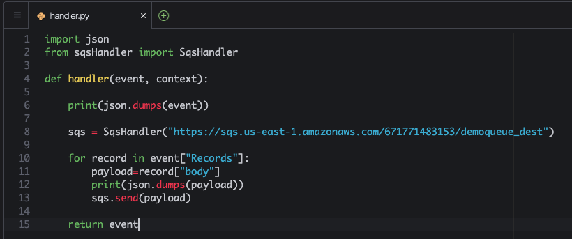
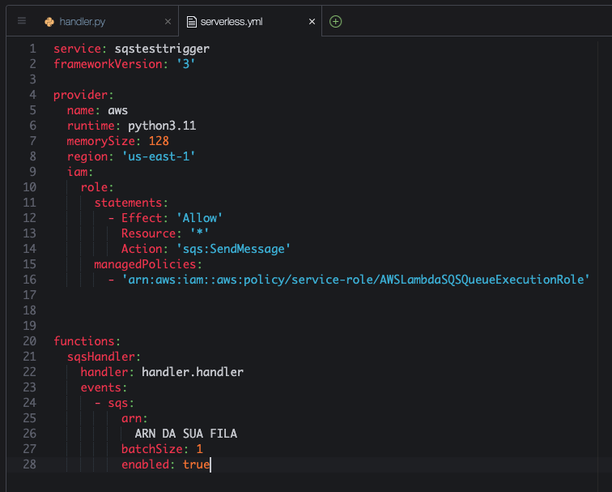
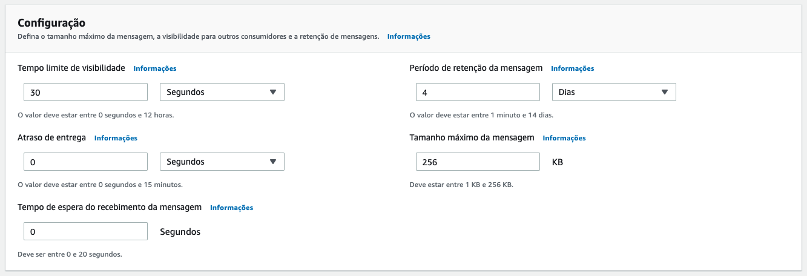
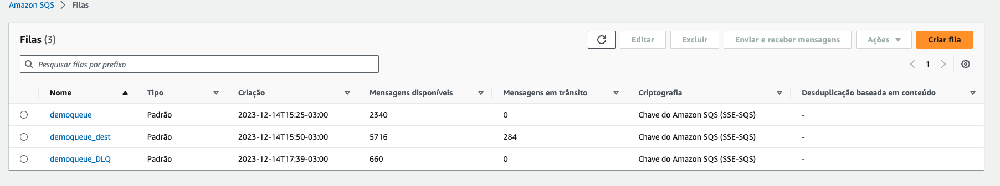

# Aula 04.3 - Lambda

1. No terminal do IDE criado no cloud9 execute o comando `cd ~/environment/usp-serverless-computing/04-SQS/03-Lambda/` para entrar na pasta que fara este exercicio.
2. Execute o comando `sls create --template "aws-python3"` no terminal para criar os arquivos do serverless framework.
3. Altere o handler.py para ficar como na imagem. Não esqueça de colocar a URL da sua fila de destino. Abra com o comando `c9 open handler.py`. Para conseguir a URL da fila de destino você pode utilizar o comando `aws sqs get-queue-url --queue-name demoqueue_dest | jq .QueueUrl -r`
   
   
<blockquote>
O código define uma função `handler` que é projetada para ser usada como um manipulador de eventos AWS Lambda. Quando um evento é acionado, a função:

1. **Imprime o evento**: Primeiro, converte o objeto `event` para JSON e o imprime. Isso é útil para debugging, permitindo ver a estrutura e o conteúdo do evento recebido pela função.

2. **Inicializa o `SqsHandler`**: Cria uma instância da classe `SqsHandler`, passando a URL de uma fila SQS chamada `demoqueue_dest`. Essa classe é responsável por abstrair operações de envio de mensagens para uma fila SQS.

3. **Processa os registros do evento**: Itera sobre cada `record` em `event["Records"]`, extrai o corpo da mensagem (`record["body"]`), o converte para JSON e o imprime. Em seguida, envia o corpo da mensagem para a fila SQS especificada na inicialização do `SqsHandler`.

4. **Retorna o evento**: A função retorna o objeto `event` recebido como entrada, o que pode ser útil para encadeamento de eventos ou para confirmação de que o evento foi processado.

Essencialmente, o script é um exemplo de como uma função Lambda pode ser usada para processar eventos (como mensagens de outra fila SQS), realizar uma ação com cada mensagem (neste caso, reenviar para outra fila) e registrar o processo.
</blockquote>

4. Altere o serverless.yml para que fique como na imagem. Para abrir utilize `c9 open serverless.yml `. Para pegar o ARN da fila demoqueue utilize o comando abaixo:
``` shell
demoqueueURL=`aws sqs get-queue-url --queue-name demoqueue | jq -r .QueueUrl` && aws sqs get-queue-attributes --queue-url $demoqueueURL --attribute-names QueueArn | jq -r .Attributes.QueueArn
```
   
<blockquote>
Este código do Serverless Framework configura um serviço chamado `sqstesttrigger` para AWS com as seguintes características:

1. **service: sqstesttrigger** - Define o nome do serviço como `sqstesttrigger`.
2. **frameworkVersion: '3'** - Especifica a versão do Serverless Framework utilizada.
3. **provider:** - Configura o provedor de nuvem (AWS) com detalhes como:
   - **runtime: python3.11** - Usa Python 3.11 como ambiente de execução para a função Lambda.
   - **memorySize: 128** - Aloca 128 MB de memória para a função.
   - **region: 'us-east-1'** - Define a região da AWS como 'us-east-1'.
   - **iam:** - Configurações IAM para a função, permitindo enviar mensagens para qualquer fila SQS e utilizando políticas gerenciadas para execução com filas SQS.
4. **functions:** - Define as funções Lambda no serviço:
   - **sqsHandler:** - Nome da função com o manipulador `handler.handler`.
     - **events:** - Configura eventos que acionam a função, especificamente:
       - **sqs:** - Configura um gatilho SQS com:
         - **arn:** - ARN da fila SQS `demoqueue` que aciona a função.
         - **batchSize: 1** - Processa uma mensagem por vez.
         - **enabled: true** - Habilita o gatilho.

Este setup permite que a função `sqsHandler` seja acionada automaticamente ao receber mensagens na fila `demoqueue`, processando-as individualmente com as permissões adequadas para interagir com o SQS.
</blockquote>

5. Vá a sua [aba do SQS](https://us-east-1.console.aws.amazon.com/sqs/v3/home?region=us-east-1#/queues/https%3A%2F%2Fsqs.us-east-1.amazonaws.com%2F671771483153%2Fdemoqueue) para editar a fila e configure sua demoqueue para ficar como na imagem, isso é necessário pois o tempo de visibilidade padrão estava em 1 segundo para forçar erros no teste da DLQ do ultimo exercicio, configure para 30 segundos.:
   
   

6. Execute o comando `sls deploy` no terminal para fazer o deploy da função lambda conectada a fila demoqueue.
7. Altere o arquivo put.py colocando a URL da sua fila demoqueue. Abra o arquivo com `c9 open put.py`
8. Execute o comando `python3 put.py` no terminal e observe no [painel do sqs](https://us-east-1.console.aws.amazon.com/sqs/v3/home?region=us-east-1#/queues) que as mensagens estão indo para a fila de destino. Tenha em mente que pode levar algum tempo para que todas as mensagens sejam processadas e movidas para a fila de destino.

   

9.  Para excluir a stack do lambda execute o comando `sls remove` no terminal.