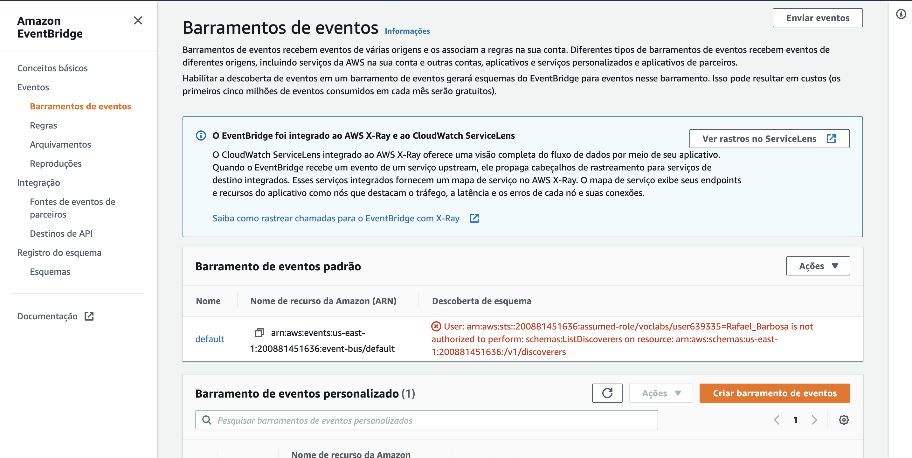
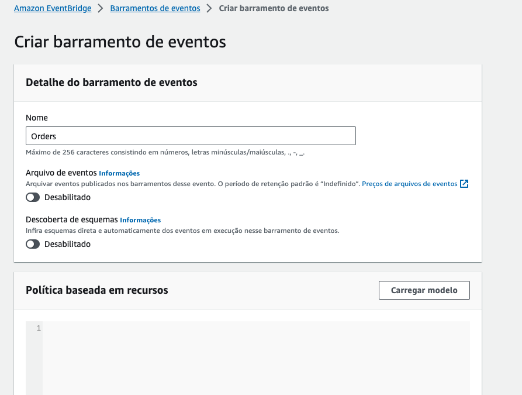
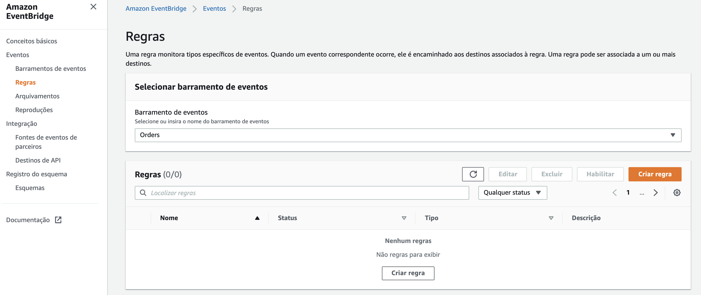
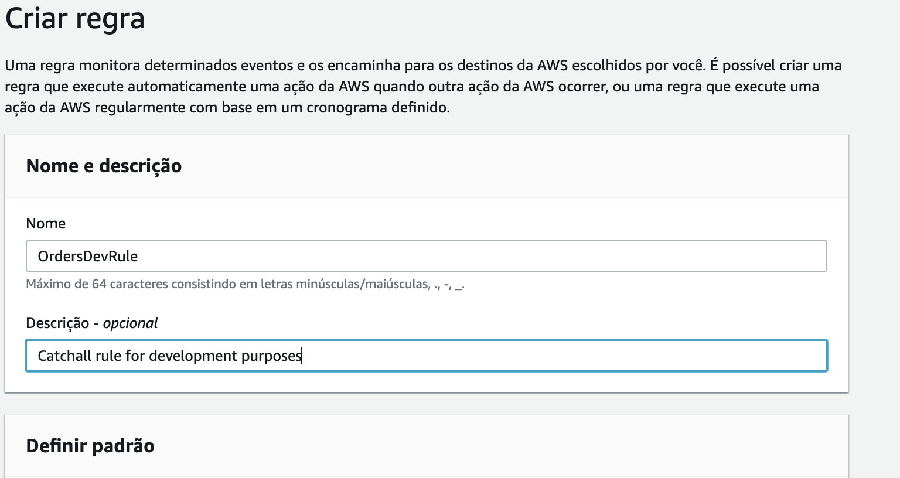
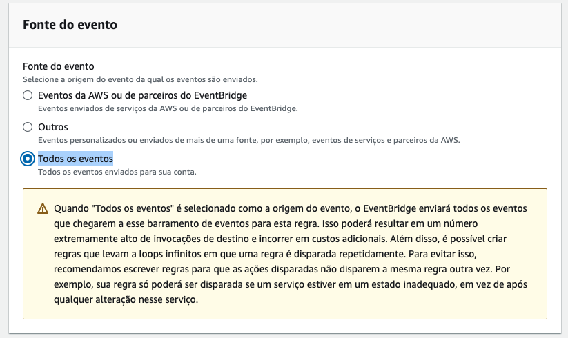
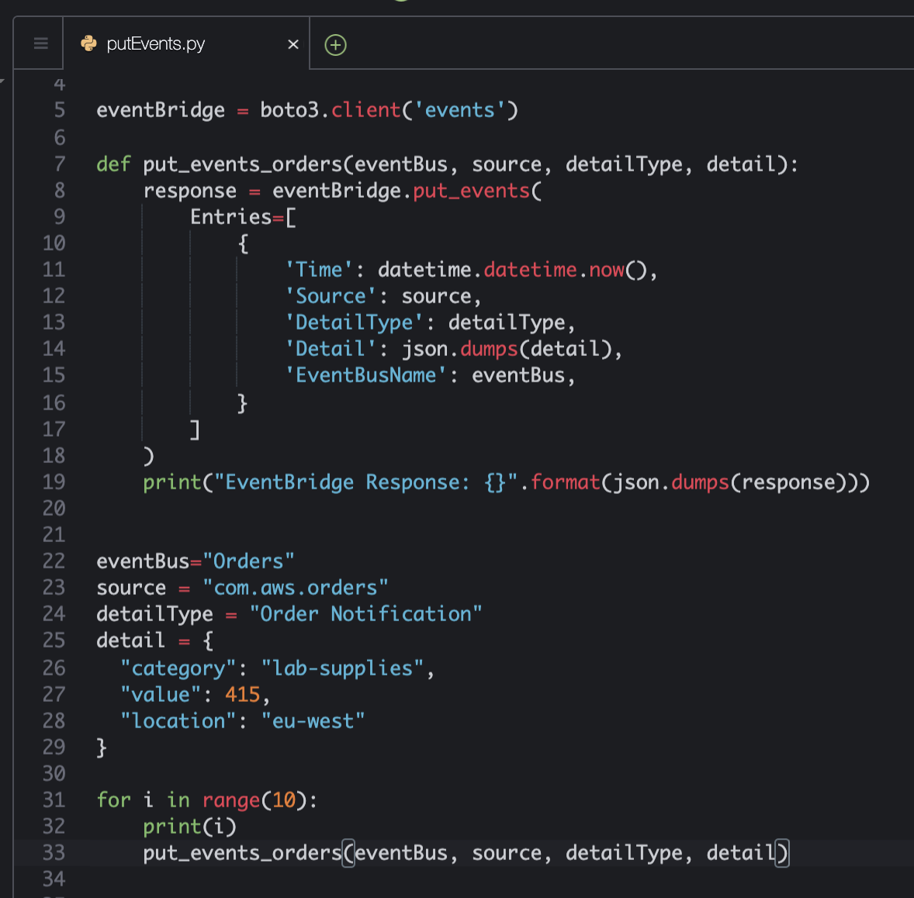
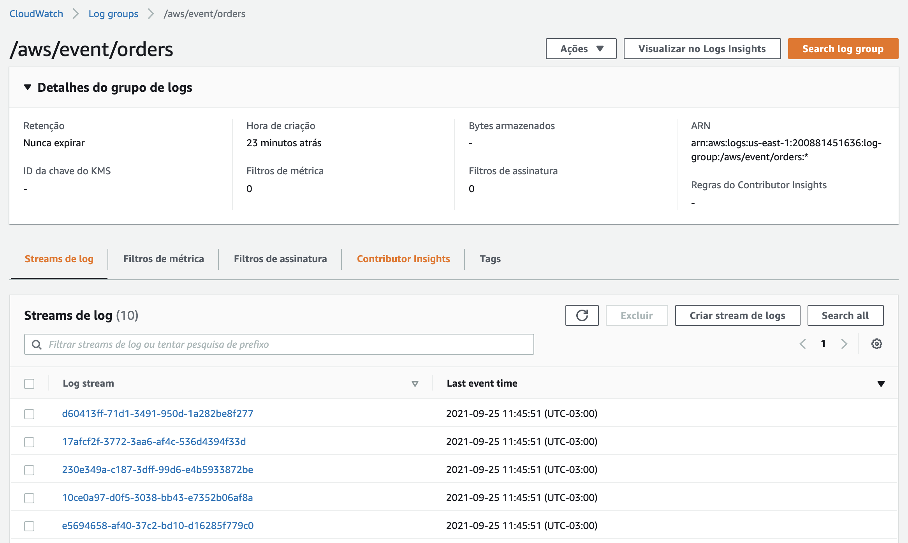
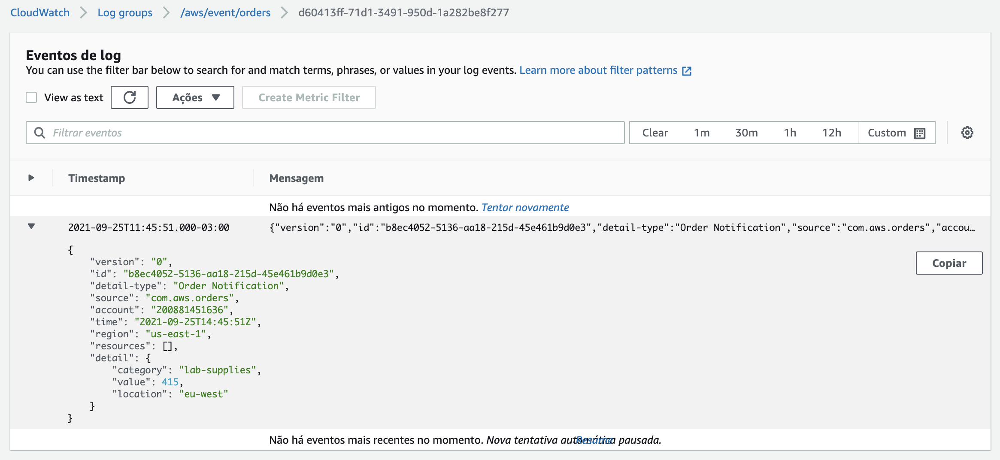
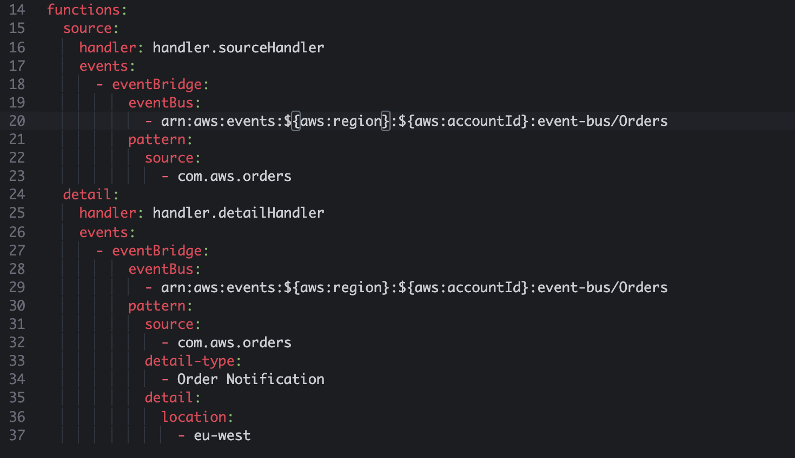

# Aula 05.1 - EventBridge

1. No terminal do IDE criado no cloud9 execute o comando `cd ~/environment/usp-serverless-computing/05-EventBridge/` para entrar na pasta que fara este exercicio.
2. Utilize virtualenv para esse exercicio com os comandos:
``` shell
python3 -m venv ~/venv 
source ~/venv/bin/activate
pip3 install boto3
```

3. Em uma nova aba do console aws entre no serviço [eventbridge](https://us-east-1.console.aws.amazon.com/events/home?region=us-east-1#/)
4. Do lado esquerdo da tela clique em `Barramento de eventos`
5. No canto direito inferior da tela clique em `Criar barramento de eventos` 
   
   

6. Coloque o nome `Orders` no barramento, deixe a política vazia e clique em `Criar`
   
   

7. No menu lateral esquerdo clique em `Regras`
8. Certifique-se de que o barramento `Orders` esta selectionado e clique em `Criar Regra` Para criar uma regra que irá capturar todos os eventos do barramento Orders e mandar uma log dentro do Cloudwatch Logs.

   

9.  Na página de criação da regra adicione o seguinte na seção Nome e Descrição:
   1. Nome: `OrdersDevRule`
   2. Descrição: `Regra para capturar todos os eventos do barramento Orders e mandar para o Cloudwatch Logs`
   
   

10. Na seção Definir Padrão adicione o seguinte:
    1. Selecione `Todos os eventos`
    2. Clique em `Próximo`
   
11. Na seção `Selecionar destinos` adicione o seguinte:
    1. Em `Destino` escolha `Grupo de logs do Cloudwatch`
    2. Em `Grupo de logs` coloque o valor `orders`
   
   

12. Certifique-se de que o barramento `Orders` esta selectionado na página de revisão.   
13. Clique em `Criar regra` ao final da página.
14. Hora de testar a regra criada. Para tal, retorne ao Cloud9.
15. Abra o arquivo putEvents.py com o comando `c9 open putEvents.py`
16. Você vai alterar o arquivo para que envie eventos para o recém criado barramento Orders. Note que o evento tem metadados como detalhe de evento, fonte e Hora, assim como o evento em si que fica em detalhe. 
17. Altere o arquivo para que fique como na imagem abaixo, não esqueça de salvar:
   
   

<blockquote>
Este script Python usa o Boto3 para interagir com o Amazon EventBridge, enviando uma série de eventos. Aqui está o passo a passo:

1. **Importações**: `boto3` para interação com a AWS, `json` para trabalhar com dados em formato JSON, e `datetime` para obter a data e hora atuais.

2. **Criação do cliente EventBridge**: `eventBridge = boto3.client('events')` inicia um cliente do serviço EventBridge da AWS.

3. **Definição da função `put_events_orders`**:
   - **Parâmetros**: Aceita `eventBus` (o nome do barramento de eventos), `source` (a fonte do evento), `detailType` (o tipo de detalhe do evento), e `detail` (um dicionário com os detalhes do evento).
   - **Envio de eventos**: Usa `eventBridge.put_events` para enviar um evento ao EventBridge, especificando:
     - `Time`: A hora atual do evento.
     - `Source`: Identifica a origem do evento.
     - `DetailType`: Descreve o tipo de evento.
     - `Detail`: Uma string JSON com informações específicas do evento.
     - `EventBusName`: O nome do barramento de eventos onde o evento será publicado.
   - **Resposta**: Imprime a resposta do EventBridge ao tentar publicar o evento, convertida para JSON.

4. **Variáveis para o evento**: Define valores para `eventBus`, `source`, `detailType`, e `detail`, que serão usados para criar os eventos.

5. **Loop para envio de eventos**: Um loop `for` que executa 10 vezes, imprimindo o índice atual e chamando `put_events_orders` com os parâmetros definidos acima para enviar eventos ao EventBridge.

Este script é útil para automatizar o envio de eventos para o EventBridge, permitindo a integração e a comunicação entre diferentes serviços e aplicações na AWS.
</blockquote>

18. No terminal execute o comando `python3 putEvents.py` para enviar 10 eventos para o barramento.
19. Para conferir a regra funcionando vá para o painel do cloudwatch utilizando o link: [Cloudwatch Logs](https://us-east-1.console.aws.amazon.com/cloudwatch/home?region=us-east-1#logsV2:log-groups/log-group/$252Faws$252Fevents$252Forders)
20. Caso tudo tenha corrido corretamente terão alguns streamings como na imagem abaixo:
    
    

21. Clique em um dos streamings para ver o evento enviado.
    
    

22. Devolta ao cloud9 agora você vai criar outras 2 regras que ativaram cada uma um lambda. Isso será executado com serverless framework apontando para o barramento que criou. Para entrar na pasta correta e abrir o arquivo no IDE execute o comando:

``` shell
cd ~/environment/usp-serverless-computing/05-EventBridge/lambda
c9 open serverless.yml
```
23.  <strong>Adicione</strong> as 2 funções lambda conforme na imagem abaixo o serverless.yml aberto no passo anterior. A função `source` captura todos os eventos que tem o source = `com.aws.orders`, já a segunda função, `detail`, captura todos os eventos do mesmo source e adiciona os filtros por tipo de detalhe e localização.

   

<blockquote>
Este código do Serverless Framework define um serviço `event-filter` para criar funções AWS Lambda que são acionadas por eventos específicos do Amazon EventBridge. Aqui está o detalhamento:

1. **service: event-filter**: Define o nome do serviço como `event-filter`.

2. **frameworkVersion: '3'**: Especifica que o serviço usa a versão 3 do Serverless Framework.

3. **provider**: Configura o provedor de nuvem (AWS) e detalhes como:
   - **runtime: python3.9**: As funções Lambda usarão Python 3.9.
   - **lambdaHashingVersion: 20201221**: Usa uma versão específica para o hashing do código Lambda, afetando como as mudanças são detectadas.
   - **iam**: Define permissões IAM, incluindo uma política gerenciada que concede acesso total ao EventBridge.

4. **eventBridge**: Configura o uso de CloudFormation para gerenciar recursos do EventBridge, facilitando a integração.

5. **functions**: Define duas funções Lambda, `source` e `detail`, cada uma com:
   - **handler**: O arquivo e a função dentro desse arquivo que o Lambda chamará.
   - **events**: Configura os gatilhos do EventBridge para cada função. A função `source` é acionada por eventos com a fonte `com.aws.orders` no barramento de eventos `Orders`. A função `detail` tem um filtro adicional para `detail-type: eu-west`, significando que só será acionada por eventos com esse tipo de detalhe.

Esse setup permite filtrar e responder a eventos específicos dentro de um fluxo de eventos, baseando-se na fonte e no tipo de detalhe, facilitando a orquestração de microsserviços e a automação de tarefas.
</blockquote>

24.  No terminal execute o comando `sls deploy --verbose` para fazer o deploy das funções e criar as regras no eventBridge. A opção --verbose no comando é para visualizar os passos executados pelo cloudformation durante o deploy.
25. Publique eventos no barramento utilizando localizações diferentes utilizando o arquivo `putRandomEvents.py`. Para tal execute os comandos abaixo:
``` shell
cd ~/environment/usp-serverless-computing/05-EventBridge/
python3 putRandomEvents.py
```
26.  Verifique os logs dos lambdas nos seguintes links:
- [source](https://console.aws.amazon.com/cloudwatch/home?region=us-east-1#logsV2:log-groups/log-group/$252Faws$252Flambda$252Fevent-filter-dev-source)
- [detail](https://console.aws.amazon.com/cloudwatch/home?region=us-east-1#logsV2:log-groups/log-group/$252Faws$252Flambda$252Fevent-filter-dev-detail)
