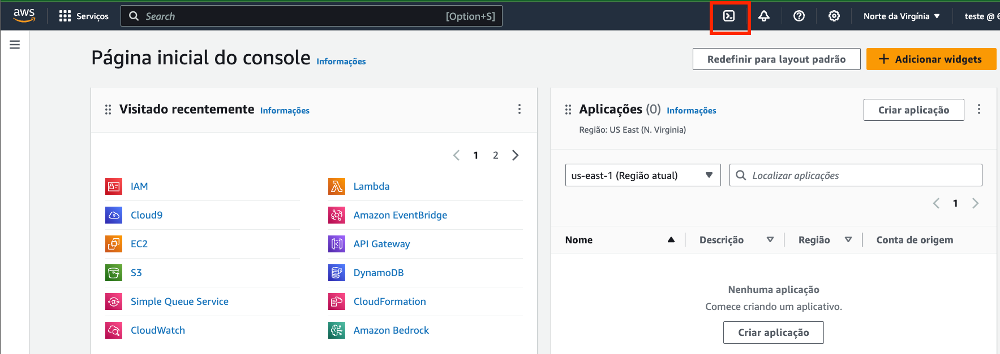
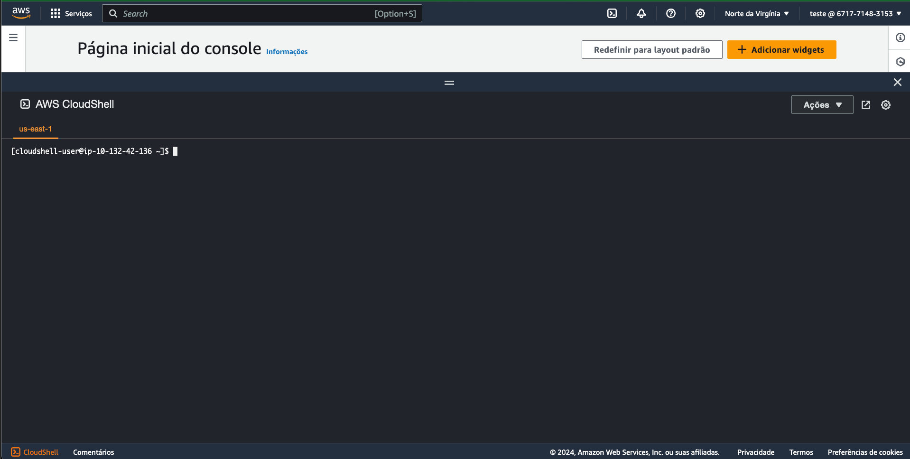
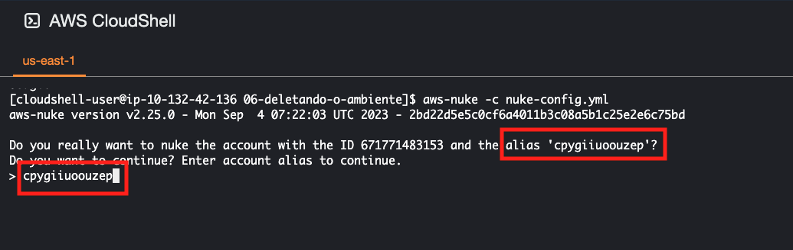

# [OPCIONAL] 06.1 - Deletando todos os recursos do ambiente

<blockquote>
O **AWS-Nuke** é uma ferramenta de código aberto desenvolvida pela **rebuy-de**, projetada para ajudar a remover de forma massiva os recursos de uma conta da Amazon Web Services (AWS). A AWS oferece uma ampla variedade de serviços e recursos, que podem ser rapidamente provisionados para atender a diversas necessidades de infraestrutura. No entanto, gerenciar o término e a remoção desses recursos pode se tornar uma tarefa complexa e demorada, especialmente em ambientes de desenvolvimento ou teste, onde os recursos podem ser criados em grande quantidade e podem não ser necessários posteriormente.

O principal objetivo do AWS-Nuke é facilitar a limpeza desses ambientes, permitindo a eliminação automatizada de praticamente todos os recursos dentro de uma conta AWS. Ele faz isso configurando listas de recursos para serem preservados, identificando e removendo todos os outros recursos que não estão nessas listas. Esta ferramenta é particularmente útil para evitar custos desnecessários ou para redefinir contas AWS para um estado limpo.

A ferramenta é altamente configurável, permitindo que os usuários especifiquem quais recursos e serviços devem ser excluídos ou mantidos através de um arquivo de configuração. Isso permite uma granularidade no controle sobre quais ações de limpeza são realizadas, garantindo que recursos críticos não sejam acidentalmente removidos. Dada a natureza destrutiva da ferramenta, é recomendado seu uso com extrema cautela, especialmente em ambientes de produção, para evitar a perda irreversível de dados ou serviços.

O AWS-Nuke é mantido no GitHub, onde a comunidade pode contribuir com o projeto, seja através da adição de novas funcionalidades, melhorando o código existente, ou reportando bugs. Essa colaboração comunitária ajuda a melhorar continuamente a ferramenta, ao mesmo tempo que fornece um recurso valioso para outros usuários enfrentando desafios semelhantes na gestão de recursos AWS.
</blockquote>

> [!CAUTION]
> Ao executar o AWS-Nuke, todos os recursos da conta AWS serão removidos na região Norte Virginia(us-east-1) e recursos globais. Isso inclui instâncias EC2, bancos de dados RDS, buckets S3, entre outros. **NÃO EXECUTE O AWS-NUKE EM AMBIENTES DE PRODUÇÃO**.

1. Acesse o [console da AWS](https://us-east-1.console.aws.amazon.com/console/home?region=us-east-1)
2. No canto superior direito da tela clique no icone do cloudshell como na imagem abaixo:

   

<blockquote>
O AWS CloudShell é um serviço baseado em navegador oferecido pela Amazon Web Services que fornece acesso à linha de comando à sua infraestrutura AWS. Com ele, usuários podem gerenciar seus recursos e serviços da AWS diretamente através do navegador, sem a necessidade de instalar ou configurar o AWS CLI (Command Line Interface) localmente. O CloudShell pré-instala e configura o AWS CLI para o ambiente do usuário, tornando mais fácil começar a trabalhar com os serviços AWS imediatamente.

Além do AWS CLI, o CloudShell também inclui uma variedade de ferramentas de desenvolvimento e scripts populares pré-instalados, como Python, Node.js, e Git, permitindo que os usuários executem scripts, interajam com seus recursos AWS, e versionem seu código sem a necessidade de configuração adicional.

Uma das principais vantagens do AWS CloudShell é que ele é automaticamente autenticado com as credenciais do usuário atualmente logado na console AWS. Isso simplifica o processo de gerenciamento de credenciais e permite que os usuários se concentrem na execução de tarefas em vez de se preocuparem com a configuração de autenticação.

O serviço é acessível diretamente da AWS Management Console e é oferecido sem custo adicional, embora o usuário possa incorrer em taxas pelos recursos da AWS que são gerenciados usando o CloudShell. O AWS CloudShell é uma ferramenta valiosa para desenvolvedores, administradores de sistemas e qualquer pessoa que precise interagir com a AWS de maneira rápida e eficiente, proporcionando uma experiência de linha de comando consistente e segura diretamente no navegador.
</blockquote>

3. Ao final do processo um terminal deve ser aberto como na imagem abaixo:
   
   
4. Execute no terminal do cloudshell a sequencia de comandos abaixo para baixar o repositório, instalar o AWS-Nuke e preparar o ambiente para a execução do AWS-Nuke:

```bash
git clone https://github.com/vamperst/usp-serverless-computing.git
cd ~/usp-serverless-computing/06-deletando-o-ambiente
chmod +x preparar-delete.sh
bash preparar-delete.sh
```

<blockquote>
Este script Bash realiza várias operações, principalmente focadas na instalação e configuração inicial da ferramenta `aws-nuke`, além de modificar configurações da conta AWS. Vamos detalhar o script passo a passo:

1. `wget -c https://github.com/rebuy-de/aws-nuke/releases/download/v2.25.0/aws-nuke-v2.25.0-linux-amd64.tar.gz`

   - Baixa o arquivo compactado da versão 2.25.0 do `aws-nuke` para sistemas Linux de 64 bits do GitHub, utilizando o `wget`. A opção `-c` permite continuar o download de onde parou caso seja interrompido.

2. `tar -xvf aws-nuke-v2.25.0-linux-amd64.tar.gz`

   - Descompacta o arquivo baixado no passo anterior, usando o comando `tar` com as opções `-xvf` para extrair o conteúdo e imprimir os nomes dos arquivos que estão sendo extraídos.

3. `mv aws-nuke-v2.25.0-linux-amd64 aws-nuke`

   - Renomeia a pasta extraída para `aws-nuke`, facilitando o acesso à ferramenta.

4. `sudo mv aws-nuke /usr/local/bin/aws-nuke`

   - Move a pasta `aws-nuke` para `/usr/local/bin/`, um diretório onde binários executáveis são comumente armazenados. Isso permite que a ferramenta `aws-nuke` seja executada de qualquer lugar no terminal. O uso de `sudo` indica que essa operação requer permissões de superusuário.

5. `aws-nuke -h`

   - Executa o comando `aws-nuke` com a opção `-h`, que exibe a ajuda e informações sobre como usar a ferramenta.

6. ```bash
   alias=`tr -dc A-Za </dev/urandom | tr '[:upper:]' '[:lower:]' | head -c 13; echo`
   ```

   - Gera uma string aleatória de 13 caracteres que será usada como alias (apelido) para a conta AWS. O comando `tr -dc A-Za` remove todos os caracteres que não são letras, `tr '[:upper:]' '[:lower:]'` converte letras maiúsculas em minúsculas, e `head -c 13` limita a saída aos primeiros 13 caracteres.

7. ```bash
   accountID=`aws sts get-caller-identity --query Account --output text`
   ```

   - Utiliza o AWS CLI para obter o ID da conta AWS atualmente ativa e armazena esse ID na variável `accountID`.

8. ```bash
   aws iam create-account-alias --account-alias $alias
   ```

   - Cria um alias para a conta AWS usando o valor armazenado na variável `alias`. Isso facilita a identificação da conta em URLs e na AWS Management Console.

9. ```bash
   sed -i "s/<IDCONTA>/$accountID/" nuke-config.yml
   ```

   - Modifica o arquivo `nuke-config.yml`, substituindo a string `<IDCONTA>` pelo ID da conta AWS obtido anteriormente. Isso é feito utilizando o comando `sed` para realizar a substituição in-place (`-i`).

Este script, portanto, automatiza a instalação do `aws-nuke`, configura um alias para a conta AWS e prepara um arquivo de configuração para ser usado com a ferramenta, facilitando a gestão de recursos AWS de forma massiva e automatizada.
</blockquote>

5. Após a execução do script, execute o comando `aws-nuke -c nuke-config.yml` para saber quais recursos serão deletados. Note que ele vai pedir para que você confirme o alias da conta, copie o Alias como mostrado na imagem e cole no prompt do terminal. Após isso, ele vai listar todos os recursos que serão deletados.
   
   
6. Revise o conteúdo da lista para garantir que não haja recursos críticos que não devem ser excluídos. Caso haja, [edite o arquivo `nuke-config.yml`](https://github.com/rebuy-de/aws-nuke) segundo a documentação e suas necessidades para incluir esses recursos na lista de preservação. Lembrando que o AWS-Nuke é uma ferramenta destrutiva e deve ser usada com extrema cautela.
7. Após revisar a lista execute o comando que irá deletar todos os recursos da conta AWS, novamente você terá que confirmar o alias da conta:

    ```bash
    aws-nuke -c nuke-config.yml --no-dry-run
    ```